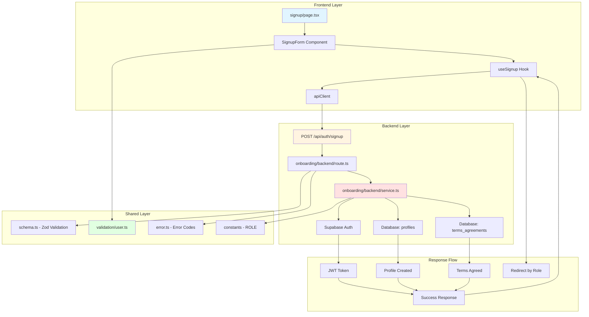

# Implementation Plan: 역할 선택 & 온보딩

## 개요

### 모듈 목록

#### 1. Backend Layer

| 모듈 | 위치 | 설명 |
|------|------|------|
| **Schema** | `src/features/onboarding/backend/schema.ts` | 회원가입 요청/응답 Zod 스키마 정의 |
| **Error** | `src/features/onboarding/backend/error.ts` | 온보딩 관련 에러 코드 정의 |
| **Service** | `src/features/onboarding/backend/service.ts` | 회원가입 비즈니스 로직 (Supabase Auth + DB) |
| **Route** | `src/features/onboarding/backend/route.ts` | Hono 라우터 정의 (POST /api/auth/signup) |
| **DTO** | `src/features/onboarding/lib/dto.ts` | 프론트엔드용 스키마 재노출 |

#### 2. Frontend Layer

| 모듈 | 위치 | 설명 |
|------|------|------|
| **Hook** | `src/features/onboarding/hooks/useSignup.ts` | React Query 기반 회원가입 Mutation 훅 |
| **Component** | `src/features/onboarding/components/signup-form.tsx` | 회원가입 폼 UI 컴포넌트 |
| **Page** | `src/app/signup/page.tsx` | 회원가입 페이지 (기존 파일 대체) |

#### 3. Shared Layer

| 모듈 | 위치 | 설명 |
|------|------|------|
| **Validation** | `src/lib/validation/user.ts` | 공통 유저 입력 검증 유틸 (이메일, 비밀번호, 휴대폰번호) |
| **Constants** | `src/features/onboarding/constants/index.ts` | 역할 관련 상수 (ROLE, REDIRECT_PATH) |

---

## Diagram



---

## Implementation Plan

### 1. Shared Layer (공통 모듈)

#### 1.1 `src/lib/validation/user.ts`

**목적**: 유저 입력 검증 유틸 함수 제공

**구현 내용**:
```typescript
// 이메일 검증
export const validateEmail = (email: string): boolean
// 비밀번호 검증 (최소 6자)
export const validatePassword = (password: string): boolean
// 휴대폰번호 검증 (010-XXXX-XXXX 형식)
export const validatePhone = (phone: string): boolean
// 이름 검증 (최소 1자, 공백 제거)
export const validateName = (name: string): boolean
```

**Unit Test**:
```typescript
describe('validateEmail', () => {
  it('should return true for valid email', () => {
    expect(validateEmail('test@example.com')).toBe(true);
  });

  it('should return false for invalid email', () => {
    expect(validateEmail('invalid')).toBe(false);
  });
});

describe('validatePassword', () => {
  it('should return true for password >= 6 chars', () => {
    expect(validatePassword('password123')).toBe(true);
  });

  it('should return false for password < 6 chars', () => {
    expect(validatePassword('pass')).toBe(false);
  });
});

describe('validatePhone', () => {
  it('should return true for valid phone format', () => {
    expect(validatePhone('010-1234-5678')).toBe(true);
  });

  it('should return false for invalid phone format', () => {
    expect(validatePhone('01012345678')).toBe(false);
  });
});

describe('validateName', () => {
  it('should return true for non-empty name', () => {
    expect(validateName('홍길동')).toBe(true);
  });

  it('should return false for empty or whitespace-only name', () => {
    expect(validateName('   ')).toBe(false);
  });
});
```

---

#### 1.2 `src/features/onboarding/constants/index.ts`

**목적**: 역할 및 리다이렉트 경로 상수

**구현 내용**:
```typescript
export const USER_ROLE = {
  LEARNER: 'learner',
  INSTRUCTOR: 'instructor',
} as const;

export type UserRole = typeof USER_ROLE[keyof typeof USER_ROLE];

export const REDIRECT_PATH_BY_ROLE: Record<UserRole, string> = {
  [USER_ROLE.LEARNER]: '/courses',
  [USER_ROLE.INSTRUCTOR]: '/instructor/dashboard',
};
```

---

### 2. Backend Layer

#### 2.1 `src/features/onboarding/backend/schema.ts`

**목적**: 요청/응답 Zod 스키마 정의

**구현 내용**:
```typescript
import { z } from 'zod';

export const SignupRequestSchema = z.object({
  email: z.string().email({ message: '유효한 이메일 주소를 입력하세요.' }),
  password: z.string().min(6, { message: '비밀번호는 최소 6자 이상이어야 합니다.' }),
  role: z.enum(['learner', 'instructor'], {
    errorMap: () => ({ message: '역할을 선택하세요.' })
  }),
  name: z.string().min(1, { message: '이름을 입력하세요.' }).trim(),
  phone: z.string().regex(/^010-\d{4}-\d{4}$/, {
    message: '올바른 휴대폰번호 형식을 입력하세요. (예: 010-1234-5678)'
  }),
  termsAgreed: z.literal(true, {
    errorMap: () => ({ message: '약관에 동의해야 가입할 수 있습니다.' })
  }),
});

export type SignupRequest = z.infer<typeof SignupRequestSchema>;

export const SignupResponseSchema = z.object({
  token: z.string(),
  user: z.object({
    id: z.string().uuid(),
    email: z.string().email(),
    role: z.enum(['learner', 'instructor']),
    name: z.string(),
    phone: z.string(),
  }),
});

export type SignupResponse = z.infer<typeof SignupResponseSchema>;

// Database row schemas
export const ProfileRowSchema = z.object({
  id: z.string().uuid(),
  role: z.enum(['learner', 'instructor', 'operator']),
  name: z.string(),
  phone: z.string(),
  created_at: z.string(),
  updated_at: z.string(),
});

export type ProfileRow = z.infer<typeof ProfileRowSchema>;
```

**Unit Test**:
```typescript
describe('SignupRequestSchema', () => {
  it('should validate correct signup request', () => {
    const valid = {
      email: 'test@example.com',
      password: 'password123',
      role: 'learner',
      name: '홍길동',
      phone: '010-1234-5678',
      termsAgreed: true,
    };
    expect(SignupRequestSchema.safeParse(valid).success).toBe(true);
  });

  it('should reject invalid email', () => {
    const invalid = { ...validData, email: 'invalid' };
    expect(SignupRequestSchema.safeParse(invalid).success).toBe(false);
  });

  it('should reject short password', () => {
    const invalid = { ...validData, password: 'pass' };
    expect(SignupRequestSchema.safeParse(invalid).success).toBe(false);
  });

  it('should reject terms not agreed', () => {
    const invalid = { ...validData, termsAgreed: false };
    expect(SignupRequestSchema.safeParse(invalid).success).toBe(false);
  });
});
```

---

#### 2.2 `src/features/onboarding/backend/error.ts`

**목적**: 온보딩 관련 에러 코드 정의

**구현 내용**:
```typescript
export const onboardingErrorCodes = {
  emailDuplicate: 'EMAIL_DUPLICATE',
  authCreationFailed: 'AUTH_CREATION_FAILED',
  profileCreationFailed: 'PROFILE_CREATION_FAILED',
  termsAgreementFailed: 'TERMS_AGREEMENT_FAILED',
  validationError: 'VALIDATION_ERROR',
  tokenIssueFailed: 'TOKEN_ISSUE_FAILED',
} as const;

type OnboardingErrorValue = typeof onboardingErrorCodes[keyof typeof onboardingErrorCodes];

export type OnboardingServiceError = OnboardingErrorValue;
```

---

#### 2.3 `src/features/onboarding/backend/service.ts`

**목적**: 회원가입 비즈니스 로직 구현

**구현 내용**:
```typescript
import type { SupabaseClient } from '@supabase/supabase-js';
import {
  failure,
  success,
  type HandlerResult,
} from '@/backend/http/response';
import type { SignupRequest, SignupResponse } from './schema';
import { onboardingErrorCodes, type OnboardingServiceError } from './error';

export const createUserAccount = async (
  client: SupabaseClient,
  request: SignupRequest,
): Promise<HandlerResult<SignupResponse, OnboardingServiceError, unknown>> => {
  // 1. Check email uniqueness (Supabase Auth handles this)
  // 2. Create auth account
  const { data: authData, error: authError } = await client.auth.admin.createUser({
    email: request.email,
    password: request.password,
    email_confirm: true, // Auto-confirm for development
  });

  if (authError) {
    if (authError.message.includes('already registered')) {
      return failure(409, onboardingErrorCodes.emailDuplicate, '이미 사용 중인 이메일입니다.');
    }
    return failure(500, onboardingErrorCodes.authCreationFailed, authError.message);
  }

  if (!authData.user) {
    return failure(500, onboardingErrorCodes.authCreationFailed, 'Auth user creation failed.');
  }

  const userId = authData.user.id;

  // 3. Create profile record (with transaction-like behavior)
  const { error: profileError } = await client
    .from('profiles')
    .insert({
      id: userId,
      role: request.role,
      name: request.name,
      phone: request.phone,
    });

  if (profileError) {
    // Rollback: delete auth user
    await client.auth.admin.deleteUser(userId);
    return failure(500, onboardingErrorCodes.profileCreationFailed, profileError.message);
  }

  // 4. Create terms agreement record
  const { error: termsError } = await client
    .from('terms_agreements')
    .insert({
      user_id: userId,
      agreed_at: new Date().toISOString(),
    });

  if (termsError) {
    // Rollback: delete profile and auth user
    await client.from('profiles').delete().eq('id', userId);
    await client.auth.admin.deleteUser(userId);
    return failure(500, onboardingErrorCodes.termsAgreementFailed, termsError.message);
  }

  // 5. Generate session token
  const { data: sessionData, error: sessionError } = await client.auth.admin.generateLink({
    type: 'magiclink',
    email: request.email,
  });

  if (sessionError || !sessionData) {
    return failure(500, onboardingErrorCodes.tokenIssueFailed, 'Token generation failed.');
  }

  // 6. Return success response
  const response: SignupResponse = {
    token: sessionData.properties.action_link, // Temporary: use proper JWT in production
    user: {
      id: userId,
      email: request.email,
      role: request.role,
      name: request.name,
      phone: request.phone,
    },
  };

  return success(response, 201);
};
```

**Unit Test**:
```typescript
describe('createUserAccount', () => {
  it('should create user account successfully', async () => {
    // Mock Supabase client
    const mockClient = createMockSupabaseClient();
    const request: SignupRequest = {
      email: 'test@example.com',
      password: 'password123',
      role: 'learner',
      name: '홍길동',
      phone: '010-1234-5678',
      termsAgreed: true,
    };

    const result = await createUserAccount(mockClient, request);

    expect(result.ok).toBe(true);
    expect(result.status).toBe(201);
    if (result.ok) {
      expect(result.data.user.email).toBe('test@example.com');
      expect(result.data.user.role).toBe('learner');
    }
  });

  it('should fail with duplicate email', async () => {
    const mockClient = createMockSupabaseClientWithDuplicateEmail();
    const request: SignupRequest = { /* ... */ };

    const result = await createUserAccount(mockClient, request);

    expect(result.ok).toBe(false);
    if (!result.ok) {
      expect(result.status).toBe(409);
      expect(result.error.code).toBe(onboardingErrorCodes.emailDuplicate);
    }
  });

  it('should rollback on profile creation failure', async () => {
    const mockClient = createMockSupabaseClientWithProfileError();
    const request: SignupRequest = { /* ... */ };

    const result = await createUserAccount(mockClient, request);

    expect(result.ok).toBe(false);
    // Verify auth user was deleted
    expect(mockClient.auth.admin.deleteUser).toHaveBeenCalled();
  });
});
```

---

#### 2.4 `src/features/onboarding/backend/route.ts`

**목적**: Hono 라우터 정의

**구현 내용**:
```typescript
import type { Hono } from 'hono';
import {
  failure,
  respond,
  type ErrorResult,
} from '@/backend/http/response';
import {
  getLogger,
  getSupabase,
  type AppEnv,
} from '@/backend/hono/context';
import { SignupRequestSchema } from './schema';
import { createUserAccount } from './service';
import {
  onboardingErrorCodes,
  type OnboardingServiceError,
} from './error';

export const registerOnboardingRoutes = (app: Hono<AppEnv>) => {
  app.post('/auth/signup', async (c) => {
    const body = await c.req.json();
    const parsedBody = SignupRequestSchema.safeParse(body);

    if (!parsedBody.success) {
      return respond(
        c,
        failure(
          400,
          onboardingErrorCodes.validationError,
          '입력값이 올바르지 않습니다.',
          parsedBody.error.format(),
        ),
      );
    }

    const supabase = getSupabase(c);
    const logger = getLogger(c);

    const result = await createUserAccount(supabase, parsedBody.data);

    if (!result.ok) {
      const errorResult = result as ErrorResult<OnboardingServiceError, unknown>;

      if (errorResult.error.code === onboardingErrorCodes.emailDuplicate) {
        logger.warn('Email duplicate attempt', { email: parsedBody.data.email });
      } else {
        logger.error('Signup failed', errorResult.error.message);
      }

      return respond(c, result);
    }

    logger.info('User created successfully', { userId: result.data.user.id });
    return respond(c, result);
  });
};
```

---

#### 2.5 `src/features/onboarding/lib/dto.ts`

**목적**: 프론트엔드용 스키마 재노출

**구현 내용**:
```typescript
export {
  SignupRequestSchema,
  SignupResponseSchema,
  type SignupRequest,
  type SignupResponse,
} from '@/features/onboarding/backend/schema';
```

---

#### 2.6 `src/backend/hono/app.ts` (수정)

**목적**: 온보딩 라우터 등록

**구현 내용**:
```typescript
import { registerOnboardingRoutes } from '@/features/onboarding/backend/route';

export const createHonoApp = () => {
  // ... existing code ...

  registerExampleRoutes(app);
  registerOnboardingRoutes(app); // 추가

  singletonApp = app;
  return app;
};
```

---

### 3. Frontend Layer

#### 3.1 `src/features/onboarding/hooks/useSignup.ts`

**목적**: React Query 기반 회원가입 Mutation 훅

**구현 내용**:
```typescript
'use client';

import { useMutation } from '@tanstack/react-query';
import { apiClient, extractApiErrorMessage } from '@/lib/remote/api-client';
import {
  SignupRequestSchema,
  SignupResponseSchema,
  type SignupRequest,
  type SignupResponse,
} from '@/features/onboarding/lib/dto';

const signup = async (request: SignupRequest): Promise<SignupResponse> => {
  try {
    const validatedRequest = SignupRequestSchema.parse(request);
    const { data } = await apiClient.post('/api/auth/signup', validatedRequest);
    return SignupResponseSchema.parse(data);
  } catch (error) {
    const message = extractApiErrorMessage(error, '회원가입에 실패했습니다.');
    throw new Error(message);
  }
};

export const useSignup = () => {
  return useMutation({
    mutationFn: signup,
    onSuccess: (data) => {
      // Store token in localStorage
      if (typeof window !== 'undefined') {
        localStorage.setItem('auth_token', data.token);
      }
    },
  });
};
```

---

#### 3.2 `src/features/onboarding/components/signup-form.tsx`

**목적**: 회원가입 폼 UI 컴포넌트

**구현 내용**:
```typescript
'use client';

import { useState } from 'react';
import { useRouter } from 'next/navigation';
import { useSignup } from '@/features/onboarding/hooks/useSignup';
import { USER_ROLE, REDIRECT_PATH_BY_ROLE, type UserRole } from '@/features/onboarding/constants';
import type { SignupRequest } from '@/features/onboarding/lib/dto';

const defaultFormState: Omit<SignupRequest, 'termsAgreed'> & { termsAgreed: boolean } = {
  email: '',
  password: '',
  role: 'learner',
  name: '',
  phone: '',
  termsAgreed: false,
};

export const SignupForm = () => {
  const router = useRouter();
  const { mutate: signup, isPending, error } = useSignup();
  const [formState, setFormState] = useState(defaultFormState);

  const handleChange = (
    e: React.ChangeEvent<HTMLInputElement | HTMLSelectElement>
  ) => {
    const { name, value, type } = e.target;
    const checked = (e.target as HTMLInputElement).checked;

    setFormState((prev) => ({
      ...prev,
      [name]: type === 'checkbox' ? checked : value,
    }));
  };

  const handleSubmit = (e: React.FormEvent<HTMLFormElement>) => {
    e.preventDefault();

    if (!formState.termsAgreed) {
      alert('약관에 동의해야 가입할 수 있습니다.');
      return;
    }

    signup(formState as SignupRequest, {
      onSuccess: (data) => {
        const redirectPath = REDIRECT_PATH_BY_ROLE[data.user.role as UserRole];
        router.push(redirectPath);
      },
    });
  };

  const isSubmitDisabled =
    !formState.email.trim() ||
    !formState.password.trim() ||
    !formState.name.trim() ||
    !formState.phone.trim() ||
    !formState.termsAgreed;

  return (
    <form onSubmit={handleSubmit} className="flex flex-col gap-4">
      <label className="flex flex-col gap-2">
        이메일
        <input
          type="email"
          name="email"
          value={formState.email}
          onChange={handleChange}
          required
          className="border rounded px-3 py-2"
        />
      </label>

      <label className="flex flex-col gap-2">
        비밀번호
        <input
          type="password"
          name="password"
          value={formState.password}
          onChange={handleChange}
          required
          minLength={6}
          className="border rounded px-3 py-2"
        />
      </label>

      <label className="flex flex-col gap-2">
        역할 선택
        <select
          name="role"
          value={formState.role}
          onChange={handleChange}
          required
          className="border rounded px-3 py-2"
        >
          <option value={USER_ROLE.LEARNER}>학습자 (Learner)</option>
          <option value={USER_ROLE.INSTRUCTOR}>강사 (Instructor)</option>
        </select>
      </label>

      <label className="flex flex-col gap-2">
        이름
        <input
          type="text"
          name="name"
          value={formState.name}
          onChange={handleChange}
          required
          className="border rounded px-3 py-2"
        />
      </label>

      <label className="flex flex-col gap-2">
        휴대폰번호
        <input
          type="tel"
          name="phone"
          value={formState.phone}
          onChange={handleChange}
          placeholder="010-1234-5678"
          required
          pattern="010-\d{4}-\d{4}"
          className="border rounded px-3 py-2"
        />
      </label>

      <label className="flex items-center gap-2">
        <input
          type="checkbox"
          name="termsAgreed"
          checked={formState.termsAgreed}
          onChange={handleChange}
          required
        />
        <span className="text-sm">약관에 동의합니다</span>
      </label>

      {error && (
        <p className="text-sm text-red-500">{error.message}</p>
      )}

      <button
        type="submit"
        disabled={isPending || isSubmitDisabled}
        className="bg-blue-600 text-white rounded px-4 py-2 disabled:bg-gray-400"
      >
        {isPending ? '처리 중...' : '회원가입'}
      </button>
    </form>
  );
};
```

**QA Sheet**:
```markdown
## QA Sheet: SignupForm Component

### Visual Testing
- [ ] 폼이 정상적으로 렌더링되는가?
- [ ] 모든 입력 필드가 표시되는가? (이메일, 비밀번호, 역할, 이름, 휴대폰번호, 약관)
- [ ] 역할 선택 드롭다운에 Learner/Instructor 옵션이 표시되는가?
- [ ] 약관 동의 체크박스가 표시되는가?

### Input Validation
- [ ] 이메일 형식이 올바르지 않으면 HTML5 validation이 동작하는가?
- [ ] 비밀번호가 6자 미만이면 제출이 차단되는가?
- [ ] 휴대폰번호 패턴(010-XXXX-XXXX)이 올바르지 않으면 제출이 차단되는가?
- [ ] 필수 입력 필드가 비어있으면 제출 버튼이 비활성화되는가?
- [ ] 약관 동의를 하지 않으면 제출이 차단되는가?

### Behavior Testing
- [ ] 폼 제출 시 useSignup 훅이 호출되는가?
- [ ] 제출 중일 때 버튼이 비활성화되고 "처리 중..." 텍스트가 표시되는가?
- [ ] 제출 성공 시 역할에 따라 올바른 경로로 리다이렉트되는가? (Learner → /courses, Instructor → /instructor/dashboard)
- [ ] 제출 실패 시 에러 메시지가 표시되는가?

### Edge Cases
- [ ] 이메일 중복 오류 시 "이미 사용 중인 이메일입니다" 메시지가 표시되는가?
- [ ] 네트워크 오류 시 "회원가입에 실패했습니다" 메시지가 표시되는가?
- [ ] 약관 미동의 시 alert가 표시되는가?

### Accessibility
- [ ] 모든 입력 필드에 적절한 label이 연결되어 있는가?
- [ ] 키보드만으로 모든 필드 입력 및 제출이 가능한가?
- [ ] 에러 메시지가 스크린 리더에서 읽히는가?
```

---

#### 3.3 `src/app/signup/page.tsx` (대체)

**목적**: 회원가입 페이지

**구현 내용**:
```typescript
'use client';

import { useEffect } from 'react';
import { useRouter } from 'next/navigation';
import Image from 'next/image';
import Link from 'next/link';
import { SignupForm } from '@/features/onboarding/components/signup-form';
import { useCurrentUser } from '@/features/auth/hooks/useCurrentUser';

type SignupPageProps = {
  params: Promise<Record<string, never>>;
};

export default function SignupPage({ params }: SignupPageProps) {
  void params;
  const router = useRouter();
  const { isAuthenticated } = useCurrentUser();

  useEffect(() => {
    if (isAuthenticated) {
      router.replace('/');
    }
  }, [isAuthenticated, router]);

  if (isAuthenticated) {
    return null;
  }

  return (
    <div className="mx-auto flex min-h-screen w-full max-w-4xl flex-col items-center justify-center gap-10 px-6 py-16">
      <header className="flex flex-col items-center gap-3 text-center">
        <h1 className="text-3xl font-semibold">회원가입</h1>
        <p className="text-slate-500">
          역할을 선택하고 프로필 정보를 입력하여 시작하세요.
        </p>
      </header>

      <div className="grid w-full gap-8 md:grid-cols-2">
        <div className="rounded-xl border border-slate-200 p-6 shadow-sm">
          <SignupForm />
          <p className="mt-4 text-xs text-slate-500">
            이미 계정이 있으신가요?{' '}
            <Link
              href="/login"
              className="font-medium text-slate-700 underline hover:text-slate-900"
            >
              로그인으로 이동
            </Link>
          </p>
        </div>

        <figure className="overflow-hidden rounded-xl border border-slate-200">
          <Image
            src="https://picsum.photos/seed/signup/640/640"
            alt="회원가입"
            width={640}
            height={640}
            className="h-full w-full object-cover"
            priority
          />
        </figure>
      </div>
    </div>
  );
}
```

**QA Sheet**:
```markdown
## QA Sheet: Signup Page

### Visual Testing
- [ ] 페이지가 정상적으로 렌더링되는가?
- [ ] 제목과 설명이 표시되는가?
- [ ] SignupForm 컴포넌트가 표시되는가?
- [ ] 로그인 페이지 링크가 표시되는가?
- [ ] 이미지가 정상적으로 로드되는가?
- [ ] 반응형 레이아웃이 정상 동작하는가? (모바일/데스크톱)

### Authentication Guard
- [ ] 이미 로그인된 사용자가 접근 시 "/" 로 리다이렉트되는가?
- [ ] 리다이렉트 중 빈 화면이 표시되는가?

### Navigation
- [ ] "로그인으로 이동" 링크 클릭 시 /login으로 이동하는가?
```

---

## 구현 순서

1. **Shared Layer** (공통 모듈부터 구현)
   - `src/lib/validation/user.ts` + Unit Test
   - `src/features/onboarding/constants/index.ts`

2. **Backend Layer** (비즈니스 로직)
   - `src/features/onboarding/backend/error.ts`
   - `src/features/onboarding/backend/schema.ts` + Unit Test
   - `src/features/onboarding/backend/service.ts` + Unit Test
   - `src/features/onboarding/backend/route.ts`
   - `src/features/onboarding/lib/dto.ts`
   - `src/backend/hono/app.ts` 수정 (라우터 등록)

3. **Frontend Layer** (UI)
   - `src/features/onboarding/hooks/useSignup.ts`
   - `src/features/onboarding/components/signup-form.tsx` + QA Sheet
   - `src/app/signup/page.tsx` + QA Sheet

4. **Integration Testing**
   - E2E 테스트: 회원가입 플로우 전체 검증
   - API 테스트: POST /api/auth/signup 엔드포인트 검증

---

## 의존성

### NPM Packages (이미 설치됨)
- `zod`: 스키마 검증
- `@tanstack/react-query`: 서버 상태 관리
- `axios`: HTTP 클라이언트
- `react-hook-form` (옵션): 폼 상태 관리 강화 시 사용 가능

### Database Migration
- `0003_create_user_tables.sql` (이미 생성됨)
- `0008_enable_rls_policies.sql` (이미 생성됨)

---

## 테스트 전략

### Unit Test
- `src/lib/validation/user.ts`: 모든 검증 함수
- `src/features/onboarding/backend/schema.ts`: Zod 스키마 검증
- `src/features/onboarding/backend/service.ts`: 비즈니스 로직 (Mock Supabase)

### Integration Test
- API 엔드포인트 테스트 (`POST /api/auth/signup`)
- DB 트랜잭션 테스트 (rollback 검증)

### E2E Test
- 회원가입 플로우 (입력 → 제출 → 리다이렉트)
- 에러 케이스 (이메일 중복, 검증 실패)

### QA Sheet
- `signup-form.tsx`: 18개 체크리스트
- `signup/page.tsx`: 8개 체크리스트

---

## 예상 작업 시간

| 작업 | 예상 시간 |
|------|----------|
| Shared Layer | 1h |
| Backend Layer | 3h |
| Frontend Layer | 2h |
| Unit Test 작성 | 2h |
| QA Sheet 검증 | 1h |
| Integration Test | 1h |
| **Total** | **10h** |

---

## 완료 기준

- [ ] 모든 모듈 구현 완료
- [ ] Unit Test 커버리지 80% 이상
- [ ] QA Sheet 모든 항목 통과
- [ ] E2E 테스트 통과
- [ ] 코드 리뷰 완료
- [ ] 문서화 완료 (JSDoc)
