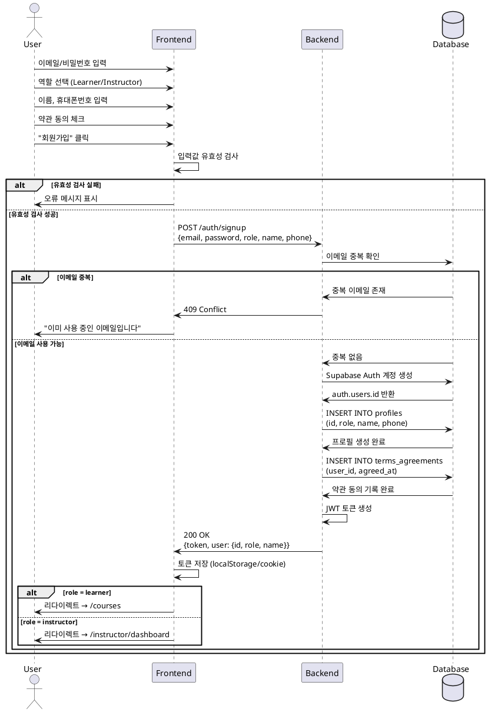

# Use Case: 역할 선택 & 온보딩

## Overview

신규 사용자가 이메일/비밀번호로 회원가입하고, 역할(Learner/Instructor)을 선택한 후 기본 프로필 정보를 입력하여 온보딩을 완료하는 프로세스.

---

## Primary Actor

신규 사용자 (Learner 또는 Instructor가 될 예정인 사람)

---

## Precondition

- 사용자가 아직 계정을 생성하지 않음
- 회원가입 페이지에 접근 가능한 상태

---

## Trigger

사용자가 회원가입 페이지에서 이메일/비밀번호를 입력하고 "회원가입" 버튼을 클릭

---

## Main Scenario

1. 사용자가 이메일과 비밀번호를 입력
2. 사용자가 역할(Learner/Instructor)을 선택
3. 사용자가 이름과 휴대폰번호를 입력
4. 사용자가 약관에 동의
5. 시스템이 이메일 중복 여부 확인
6. 시스템이 Supabase Auth에 계정 생성
7. 시스템이 profiles 테이블에 역할 및 프로필 정보 저장
8. 시스템이 terms_agreements 테이블에 약관 동의 이력 저장
9. 시스템이 JWT 토큰 발급
10. Learner → 코스 카탈로그 페이지로 리다이렉트
11. Instructor → 대시보드 페이지로 리다이렉트

---

## Edge Cases

### 1. 이메일 중복
- **현상**: 이미 가입된 이메일로 재가입 시도
- **처리**: "이미 사용 중인 이메일입니다" 오류 메시지 표시, 로그인 페이지 안내

### 2. 비밀번호 형식 오류
- **현상**: 비밀번호가 최소 요구사항 미충족 (예: 6자 미만)
- **처리**: "비밀번호는 최소 6자 이상이어야 합니다" 오류 메시지 표시

### 3. 필수 입력값 누락
- **현상**: 이름, 휴대폰번호, 역할 미선택
- **처리**: 해당 필드에 "필수 입력 항목입니다" 오류 메시지 표시

### 4. 약관 미동의
- **현상**: 약관 동의 체크박스 미선택
- **처리**: "약관에 동의해야 가입할 수 있습니다" 오류 메시지 표시

### 5. 휴대폰번호 형식 오류
- **현상**: 휴대폰번호가 유효하지 않은 형식
- **처리**: "올바른 휴대폰번호 형식을 입력하세요" 오류 메시지 표시

### 6. 네트워크 오류
- **현상**: Supabase Auth 연결 실패
- **처리**: "서버 연결에 실패했습니다. 잠시 후 다시 시도해주세요" 오류 메시지 표시

### 7. 토큰 발급 실패
- **현상**: Auth 계정은 생성되었으나 토큰 발급 실패
- **처리**: 로그인 페이지로 리다이렉트, "가입이 완료되었습니다. 로그인해주세요" 안내

---

## Business Rules

### BR-001: 역할 필수 선택
- 모든 사용자는 가입 시 반드시 Learner 또는 Instructor 중 하나의 역할을 선택해야 함
- 역할은 가입 후 변경 불가 (향후 확장 고려 시 운영자 승인 필요)

### BR-002: 이메일 고유성
- 동일한 이메일로 중복 가입 불가
- 이메일은 Supabase Auth에서 고유 식별자로 사용

### BR-003: 프로필 필수 정보
- 이름, 휴대폰번호는 필수 입력 항목
- 빈 값 또는 공백만 있는 값 허용 안 됨

### BR-004: 약관 동의 필수
- 회원가입 시 약관 동의는 필수
- 약관 동의 이력은 terms_agreements 테이블에 타임스탬프와 함께 기록

### BR-005: 비밀번호 보안 정책
- 최소 6자 이상 (Supabase Auth 기본 정책)
- 추후 강화 가능 (대소문자, 숫자, 특수문자 조합 등)

### BR-006: 역할 기반 초기 리다이렉트
- Learner: `/courses` (코스 카탈로그)
- Instructor: `/instructor/dashboard` (강사 대시보드)

### BR-007: 프로필 생성 원자성
- Auth 계정, profiles, terms_agreements 생성은 하나의 트랜잭션으로 처리
- 중간 단계 실패 시 전체 롤백

---

## Sequence Diagram



---

## Data Flow

```
Input:
- email: string (이메일 형식)
- password: string (최소 6자)
- role: 'learner' | 'instructor'
- name: string (최소 1자)
- phone: string (휴대폰번호 형식)
- terms_agreed: boolean (true)

Process:
1. Validation (FE)
2. Email uniqueness check (BE → DB)
3. Create auth.users record (BE → Supabase Auth)
4. Create profiles record (BE → DB)
5. Create terms_agreements record (BE → DB)
6. Generate JWT token (BE)

Output:
- Success: {token, user: {id, role, name}}
- Error: {error: string, code: number}
```

---

## API Specification

### Endpoint
```
POST /api/auth/signup
```

### Request Body
```json
{
  "email": "user@example.com",
  "password": "password123",
  "role": "learner",
  "name": "홍길동",
  "phone": "010-1234-5678",
  "terms_agreed": true
}
```

### Response (Success)
```json
{
  "token": "eyJhbGciOiJIUzI1NiIsInR5cCI6IkpXVCJ9...",
  "user": {
    "id": "uuid-v4",
    "email": "user@example.com",
    "role": "learner",
    "name": "홍길동",
    "phone": "010-1234-5678"
  }
}
```

### Response (Error)
```json
{
  "error": "이미 사용 중인 이메일입니다",
  "code": 409
}
```

---

## Database Operations

### 1. Check Email Uniqueness
```sql
SELECT EXISTS (
  SELECT 1 FROM auth.users WHERE email = $1
);
```

### 2. Create Profile
```sql
INSERT INTO profiles (id, role, name, phone)
VALUES ($1, $2, $3, $4)
RETURNING *;
```

### 3. Create Terms Agreement
```sql
INSERT INTO terms_agreements (user_id, agreed_at)
VALUES ($1, NOW())
RETURNING *;
```

---

## Testing Checklist

- [ ] 정상 회원가입 (Learner)
- [ ] 정상 회원가입 (Instructor)
- [ ] 이메일 중복 오류
- [ ] 비밀번호 형식 오류
- [ ] 필수 입력값 누락 오류
- [ ] 약관 미동의 오류
- [ ] 휴대폰번호 형식 오류
- [ ] 역할 미선택 오류
- [ ] 네트워크 오류 처리
- [ ] 역할별 리다이렉트 검증
- [ ] JWT 토큰 발급 및 저장 검증
