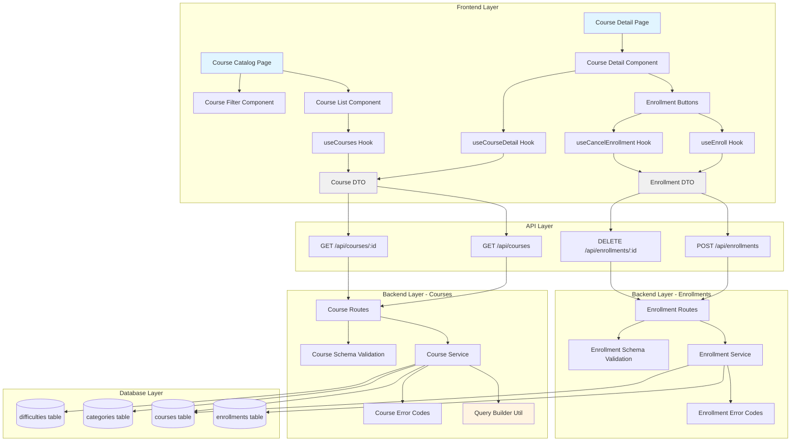

# Implementation Plan: Course Exploration & Enrollment/Cancellation

## 개요

### Backend Modules

| Module | Location | Description |
|--------|----------|-------------|
| **Course Schema** | `src/features/courses/backend/schema.ts` | Course 조회/필터링 관련 요청/응답 스키마 (Zod) |
| **Course Service** | `src/features/courses/backend/service.ts` | Course 조회 비즈니스 로직 (published 필터링, 검색/필터/정렬) |
| **Course Routes** | `src/features/courses/backend/route.ts` | Course API 엔드포인트 (GET /api/courses, GET /api/courses/:id) |
| **Course Error Codes** | `src/features/courses/backend/error.ts` | Course 관련 에러 코드 정의 |
| **Enrollment Schema** | `src/features/enrollments/backend/schema.ts` | Enrollment 생성/삭제 요청/응답 스키마 |
| **Enrollment Service** | `src/features/enrollments/backend/service.ts` | Enrollment 비즈니스 로직 (중복 체크, 상태 검증, soft delete) |
| **Enrollment Routes** | `src/features/enrollments/backend/route.ts` | Enrollment API 엔드포인트 (POST /api/enrollments, DELETE /api/enrollments/:id) |
| **Enrollment Error Codes** | `src/features/enrollments/backend/error.ts` | Enrollment 관련 에러 코드 정의 |

### Frontend Modules

| Module | Location | Description |
|--------|----------|-------------|
| **Course DTO** | `src/features/courses/lib/dto.ts` | Backend schema 재노출 (타입 공유) |
| **Enrollment DTO** | `src/features/enrollments/lib/dto.ts` | Backend schema 재노출 (타입 공유) |
| **Course Hooks** | `src/features/courses/hooks/useCourses.ts` | 코스 목록 조회 React Query 훅 |
| | `src/features/courses/hooks/useCourseDetail.ts` | 코스 상세 조회 React Query 훅 |
| **Enrollment Hooks** | `src/features/enrollments/hooks/useEnroll.ts` | 수강신청 Mutation 훅 |
| | `src/features/enrollments/hooks/useCancelEnrollment.ts` | 수강취소 Mutation 훅 |
| **Course Components** | `src/features/courses/components/course-list.tsx` | 코스 목록 표시 컴포넌트 |
| | `src/features/courses/components/course-card.tsx` | 개별 코스 카드 컴포넌트 |
| | `src/features/courses/components/course-filter.tsx` | 검색/필터 UI 컴포넌트 |
| | `src/features/courses/components/course-detail.tsx` | 코스 상세 정보 컴포넌트 |
| **Course Page** | `src/app/courses/page.tsx` | 코스 카탈로그 페이지 |
| | `src/app/courses/[id]/page.tsx` | 코스 상세 페이지 |

### Shared Modules

| Module | Location | Description |
|--------|----------|-------------|
| **Pagination Utility** | `src/lib/pagination.ts` | 페이지네이션 계산 유틸리티 (재사용 가능) |
| **Query Builder** | `src/lib/supabase-query-builder.ts` | Supabase 쿼리 빌더 헬퍼 (필터/정렬/검색 공통화) |

---

## Diagram



---

## Implementation Plan

### Phase 1: Database & Shared Utilities

#### 1.1 Shared Query Builder Utility
**Location**: `src/lib/supabase-query-builder.ts`

**Purpose**: 재사용 가능한 Supabase 쿼리 빌더 헬퍼 함수

**Implementation**:
```typescript
export type FilterOptions = {
  search?: string;
  searchFields?: string[];
  filters?: Record<string, unknown>;
  sort?: {
    field: string;
    order: 'asc' | 'desc';
  };
  pagination?: {
    page: number;
    pageSize: number;
  };
};

export const buildQuery = <T>(
  query: PostgrestQueryBuilder<T>,
  options: FilterOptions
) => {
  // Apply search filter
  // Apply field filters
  // Apply sorting
  // Apply pagination
  return query;
};
```

**Unit Tests**:
- ✅ Search filter with single field
- ✅ Search filter with multiple fields
- ✅ Multiple filters with AND logic
- ✅ Sort by field ascending/descending
- ✅ Pagination offset calculation
- ✅ Empty options return unmodified query

---

#### 1.2 Pagination Utility
**Location**: `src/lib/pagination.ts`

**Purpose**: 페이지네이션 계산 로직 재사용

**Implementation**:
```typescript
export type PaginationParams = {
  page: number;
  pageSize: number;
};

export type PaginationResult = {
  offset: number;
  limit: number;
  page: number;
  pageSize: number;
};

export const calculatePagination = (params: PaginationParams): PaginationResult => {
  // Calculate offset and limit
};

export const createPaginationMeta = (
  total: number,
  current: PaginationResult
) => {
  // Return { total, page, pageSize, totalPages }
};
```

**Unit Tests**:
- ✅ Page 1 offset is 0
- ✅ Page 2 offset is pageSize
- ✅ Calculate total pages correctly
- ✅ Handle edge case: page 0 defaults to 1
- ✅ Handle edge case: pageSize < 1 defaults to 10

---

### Phase 2: Backend - Courses Feature

#### 2.1 Course Schema
**Location**: `src/features/courses/backend/schema.ts`

**Implementation**:
```typescript
// GET /api/courses query params
export const CourseListQuerySchema = z.object({
  search: z.string().optional(),
  category: z.coerce.number().optional(),
  difficulty: z.coerce.number().optional(),
  sort: z.enum(['latest', 'popular']).default('latest'),
  page: z.coerce.number().min(1).default(1),
  pageSize: z.coerce.number().min(1).max(100).default(20),
});

// Course detail response
export const CourseDetailSchema = z.object({
  id: z.number(),
  title: z.string(),
  description: z.string().nullable(),
  category: z.object({
    id: z.number(),
    name: z.string(),
  }).nullable(),
  difficulty: z.object({
    id: z.number(),
    level: z.string(),
  }).nullable(),
  instructor: z.object({
    id: z.string().uuid(),
    name: z.string(),
  }),
  curriculum: z.string().nullable(),
  status: z.enum(['draft', 'published', 'archived']),
  isEnrolled: z.boolean(),
  created_at: z.string(),
  updated_at: z.string(),
});

// Course list response
export const CourseListResponseSchema = z.object({
  courses: z.array(CourseDetailSchema),
  pagination: z.object({
    total: z.number(),
    page: z.number(),
    pageSize: z.number(),
    totalPages: z.number(),
  }),
});
```

---

#### 2.2 Course Error Codes
**Location**: `src/features/courses/backend/error.ts`

**Implementation**:
```typescript
export const courseErrorCodes = {
  notFound: 'COURSE_NOT_FOUND',
  notPublished: 'COURSE_NOT_PUBLISHED',
  invalidQuery: 'INVALID_QUERY_PARAMS',
  databaseError: 'DATABASE_ERROR',
} as const;

export type CourseServiceError =
  (typeof courseErrorCodes)[keyof typeof courseErrorCodes];
```

---

#### 2.3 Course Service
**Location**: `src/features/courses/backend/service.ts`

**Implementation**:
```typescript
/**
 * Get published courses with filters, search, and pagination
 */
export const getCourses = async (
  client: SupabaseClient,
  query: CourseListQuery
): Promise<HandlerResult<CourseListResponse, CourseServiceError, unknown>> => {
  // Build base query with published filter
  // Apply search on title + description
  // Apply category/difficulty filters
  // Apply sorting (latest=created_at desc, popular=enrollment count)
  // Apply pagination
  // Join categories, difficulties, profiles
  // Return with pagination meta
};

/**
 * Get course detail by ID with enrollment status for user
 */
export const getCourseById = async (
  client: SupabaseClient,
  courseId: number,
  userId?: string
): Promise<HandlerResult<CourseDetail, CourseServiceError, unknown>> => {
  // Fetch course with joins
  // Check if user is enrolled (if userId provided)
  // Return course detail with isEnrolled flag
};
```

**Unit Tests**:
- ✅ Returns only published courses
- ✅ Filters by category correctly
- ✅ Filters by difficulty correctly
- ✅ Search matches title (case-insensitive)
- ✅ Search matches description (case-insensitive)
- ✅ Sort by latest (created_at desc)
- ✅ Sort by popular (enrollment count desc)
- ✅ Pagination returns correct page
- ✅ Returns 404 for non-existent course
- ✅ Returns 404 for draft course (public access)
- ✅ Sets isEnrolled=true when user is enrolled
- ✅ Sets isEnrolled=false when user is not enrolled

---

#### 2.4 Course Routes
**Location**: `src/features/courses/backend/route.ts`

**Implementation**:
```typescript
export const registerCourseRoutes = (app: Hono<AppEnv>) => {
  // GET /api/courses - List courses
  app.get('/api/courses', async (c) => {
    // Parse query params with CourseListQuerySchema
    // Validate with Zod
    // Call getCourses service
    // Return response
  });

  // GET /api/courses/:id - Course detail
  app.get('/api/courses/:id', async (c) => {
    // Parse courseId from params
    // Extract userId from auth context (optional)
    // Call getCourseById service
    // Return response
  });
};
```

---

### Phase 3: Backend - Enrollments Feature

#### 3.1 Enrollment Schema
**Location**: `src/features/enrollments/backend/schema.ts`

**Implementation**:
```typescript
export const EnrollRequestSchema = z.object({
  courseId: z.number(),
});

export const EnrollResponseSchema = z.object({
  id: z.number(),
  courseId: z.number(),
  userId: z.string().uuid(),
  enrolledAt: z.string(),
});

export const CancelEnrollmentResponseSchema = z.object({
  success: z.boolean(),
  message: z.string(),
});
```

---

#### 3.2 Enrollment Error Codes
**Location**: `src/features/enrollments/backend/error.ts`

**Implementation**:
```typescript
export const enrollmentErrorCodes = {
  courseNotFound: 'COURSE_NOT_FOUND',
  courseNotPublished: 'COURSE_NOT_PUBLISHED',
  alreadyEnrolled: 'ALREADY_ENROLLED',
  notEnrolled: 'NOT_ENROLLED',
  unauthorized: 'UNAUTHORIZED',
  validationError: 'VALIDATION_ERROR',
  databaseError: 'DATABASE_ERROR',
} as const;

export type EnrollmentServiceError =
  (typeof enrollmentErrorCodes)[keyof typeof enrollmentErrorCodes];
```

---

#### 3.3 Enrollment Service
**Location**: `src/features/enrollments/backend/service.ts`

**Implementation**:
```typescript
/**
 * Enroll user in a course
 * BR-001: Only published courses
 * BR-002: Prevent duplicate enrollment
 */
export const enrollInCourse = async (
  client: SupabaseClient,
  userId: string,
  courseId: number
): Promise<HandlerResult<EnrollResponse, EnrollmentServiceError, unknown>> => {
  // 1. Check if course exists and is published
  // 2. Check if already enrolled
  // 3. Insert enrollment record
  // 4. Return enrollment data
};

/**
 * Cancel enrollment (soft delete)
 * BR-004: Maintain audit trail, exclude from grade calculation
 */
export const cancelEnrollment = async (
  client: SupabaseClient,
  userId: string,
  courseId: number
): Promise<HandlerResult<CancelEnrollmentResponse, EnrollmentServiceError, unknown>> => {
  // 1. Check if enrollment exists
  // 2. Verify ownership (user can only cancel their own enrollment)
  // 3. Delete enrollment record
  // 4. Return success response
};
```

**Unit Tests**:
- ✅ Enrollment succeeds for published course
- ✅ Enrollment fails for non-existent course (404)
- ✅ Enrollment fails for draft course (400)
- ✅ Enrollment fails for archived course (400)
- ✅ Enrollment fails if already enrolled (409)
- ✅ Enrollment creates record with correct data
- ✅ Cancellation succeeds for enrolled user
- ✅ Cancellation fails if not enrolled (404)
- ✅ Cancellation fails for other user's enrollment (403)
- ✅ Cancellation removes enrollment record

---

#### 3.4 Enrollment Routes
**Location**: `src/features/enrollments/backend/route.ts`

**Implementation**:
```typescript
export const registerEnrollmentRoutes = (app: Hono<AppEnv>) => {
  // POST /api/enrollments - Enroll in course
  app.post('/api/enrollments', async (c) => {
    // Parse request body
    // Validate with EnrollRequestSchema
    // Extract userId from auth context
    // Check user role is 'learner' (BR-006)
    // Call enrollInCourse service
    // Return response
  });

  // DELETE /api/enrollments/:courseId - Cancel enrollment
  app.delete('/api/enrollments/:courseId', async (c) => {
    // Parse courseId from params
    // Extract userId from auth context
    // Verify user is authenticated
    // Call cancelEnrollment service
    // Return response
  });
};
```

---

### Phase 4: Frontend - DTO & Hooks

#### 4.1 Course DTO
**Location**: `src/features/courses/lib/dto.ts`

**Implementation**:
```typescript
export {
  CourseListQuerySchema,
  CourseDetailSchema,
  CourseListResponseSchema,
  type CourseListQuery,
  type CourseDetail,
  type CourseListResponse,
} from '@/features/courses/backend/schema';
```

---

#### 4.2 Enrollment DTO
**Location**: `src/features/enrollments/lib/dto.ts`

**Implementation**:
```typescript
export {
  EnrollRequestSchema,
  EnrollResponseSchema,
  CancelEnrollmentResponseSchema,
  type EnrollRequest,
  type EnrollResponse,
  type CancelEnrollmentResponse,
} from '@/features/enrollments/backend/schema';
```

---

#### 4.3 Course Hooks
**Location**: `src/features/courses/hooks/useCourses.ts`

**Implementation**:
```typescript
export const useCourses = (query: CourseListQuery) => {
  return useQuery({
    queryKey: ['courses', query],
    queryFn: async () => {
      const { data } = await apiClient.get('/api/courses', { params: query });
      return CourseListResponseSchema.parse(data);
    },
  });
};
```

**Location**: `src/features/courses/hooks/useCourseDetail.ts`

**Implementation**:
```typescript
export const useCourseDetail = (courseId: number) => {
  return useQuery({
    queryKey: ['course', courseId],
    queryFn: async () => {
      const { data } = await apiClient.get(`/api/courses/${courseId}`);
      return CourseDetailSchema.parse(data);
    },
  });
};
```

---

#### 4.4 Enrollment Hooks
**Location**: `src/features/enrollments/hooks/useEnroll.ts`

**Implementation**:
```typescript
export const useEnroll = () => {
  const queryClient = useQueryClient();

  return useMutation({
    mutationFn: async (courseId: number) => {
      const { data } = await apiClient.post('/api/enrollments', { courseId });
      return EnrollResponseSchema.parse(data);
    },
    onSuccess: (_, courseId) => {
      // Invalidate course detail query to update isEnrolled
      queryClient.invalidateQueries({ queryKey: ['course', courseId] });
      // Invalidate user's enrolled courses
      queryClient.invalidateQueries({ queryKey: ['my-courses'] });
    },
  });
};
```

**Location**: `src/features/enrollments/hooks/useCancelEnrollment.ts`

**Implementation**:
```typescript
export const useCancelEnrollment = () => {
  const queryClient = useQueryClient();

  return useMutation({
    mutationFn: async (courseId: number) => {
      const { data } = await apiClient.delete(`/api/enrollments/${courseId}`);
      return CancelEnrollmentResponseSchema.parse(data);
    },
    onSuccess: (_, courseId) => {
      queryClient.invalidateQueries({ queryKey: ['course', courseId] });
      queryClient.invalidateQueries({ queryKey: ['my-courses'] });
    },
  });
};
```

---

### Phase 5: Frontend - Components

#### 5.1 Course Filter Component
**Location**: `src/features/courses/components/course-filter.tsx`

**Purpose**: 검색, 카테고리, 난이도, 정렬 UI

**QA Sheet**:
- [ ] Search input updates query on debounce (300ms)
- [ ] Category select updates immediately
- [ ] Difficulty select updates immediately
- [ ] Sort select updates immediately
- [ ] Clear filters button resets all filters
- [ ] Filter state persists in URL query params
- [ ] Filters work in combination (AND logic)

**Required Shadcn Components**:
```bash
npx shadcn@latest add input
npx shadcn@latest add select
npx shadcn@latest add button
```

---

#### 5.2 Course Card Component
**Location**: `src/features/courses/components/course-card.tsx`

**Purpose**: 개별 코스 표시 카드

**QA Sheet**:
- [ ] Displays course title, description excerpt
- [ ] Shows category and difficulty badges
- [ ] Shows instructor name
- [ ] Click navigates to course detail page
- [ ] Hover effect indicates clickability
- [ ] Truncates long descriptions with ellipsis
- [ ] Responsive layout on mobile/tablet/desktop

**Required Shadcn Components**:
```bash
npx shadcn@latest add card
npx shadcn@latest add badge
```

---

#### 5.3 Course List Component
**Location**: `src/features/courses/components/course-list.tsx`

**Purpose**: 코스 목록 및 페이지네이션

**QA Sheet**:
- [ ] Renders grid of course cards
- [ ] Shows loading state while fetching
- [ ] Shows empty state if no courses
- [ ] Shows error state on fetch failure
- [ ] Pagination controls at bottom
- [ ] Page number updates URL
- [ ] Responsive grid (1 col mobile, 2 col tablet, 3 col desktop)

**Required Shadcn Components**:
```bash
npx shadcn@latest add skeleton
```

---

#### 5.4 Course Detail Component
**Location**: `src/features/courses/components/course-detail.tsx`

**Purpose**: 코스 상세 정보 및 수강신청/취소 버튼

**QA Sheet**:
- [ ] Displays full course information
- [ ] Shows instructor profile
- [ ] Shows curriculum if available
- [ ] Enrollment button visible if not enrolled
- [ ] Cancel button visible if enrolled
- [ ] Enrollment button disabled if not authenticated
- [ ] Shows success toast on enrollment
- [ ] Shows error toast on enrollment failure
- [ ] Shows confirmation dialog before cancellation
- [ ] Disables buttons during API calls

**Required Shadcn Components**:
```bash
npx shadcn@latest add dialog
npx shadcn@latest add toast
```

---

### Phase 6: Frontend - Pages

#### 6.1 Course Catalog Page
**Location**: `src/app/courses/page.tsx`

**Purpose**: 코스 탐색 메인 페이지

**QA Sheet**:
- [ ] Loads with default filters (published, latest)
- [ ] URL query params sync with filter state
- [ ] Browser back/forward navigates correctly
- [ ] Page title is SEO-friendly
- [ ] Meta description includes course count
- [ ] Responsive layout on all devices

---

#### 6.2 Course Detail Page
**Location**: `src/app/courses/[id]/page.tsx`

**Purpose**: 코스 상세 페이지

**QA Sheet**:
- [ ] Fetches course by ID from params
- [ ] Shows 404 page if course not found
- [ ] Shows authentication required message if not logged in
- [ ] Shows role restriction message if not learner
- [ ] Back button navigates to catalog
- [ ] Share button copies URL to clipboard
- [ ] Page title is course title
- [ ] Meta description is course description

---

## Implementation Order

1. **Phase 1**: Shared utilities (Query Builder, Pagination)
2. **Phase 2**: Backend - Courses (Schema → Error → Service → Routes)
3. **Phase 3**: Backend - Enrollments (Schema → Error → Service → Routes)
4. **Phase 4**: Frontend - DTO & Hooks
5. **Phase 5**: Frontend - Components (Filter → Card → List → Detail)
6. **Phase 6**: Frontend - Pages (Catalog → Detail)

---

## Testing Strategy

### Backend Unit Tests
- Use Vitest for unit testing
- Mock Supabase client responses
- Test all business rules (BR-001 through BR-006)
- Test error handling and edge cases
- Target: >80% coverage

### Frontend QA Checklists
- Manual QA using provided sheets
- Focus on user interactions and edge cases
- Test accessibility (keyboard navigation, screen readers)
- Test responsive design on multiple devices
- Test error states and loading states

### Integration Testing
- Test full user flow: Browse → View → Enroll → Cancel
- Test with real Supabase instance (development)
- Verify database state after operations
- Test concurrent enrollments (race conditions)
