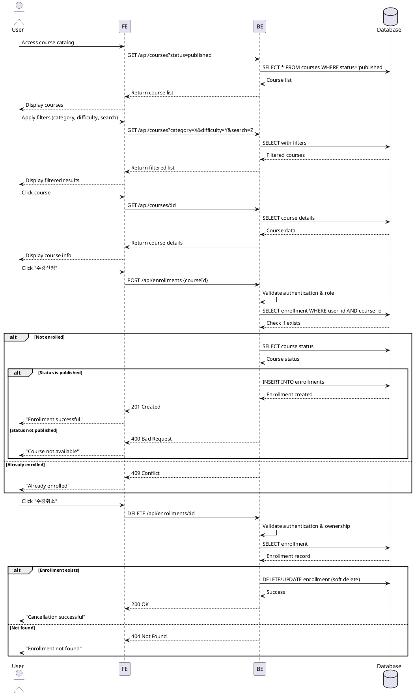

# Use Case Specification: Course Exploration & Enrollment/Cancellation

## Primary Actor
Learner (authenticated user with `role=learner`)

## Preconditions
- User is authenticated and has `role=learner`
- At least one course exists with `status=published`

## Trigger
User accesses the course catalog page to browse and enroll in courses

## Main Scenario

### 1. Browse Courses
1. User navigates to course catalog
2. System displays all `published` courses
3. User applies filters (category, difficulty) and/or search keywords
4. System returns filtered course list sorted by selected criteria (latest/popular)
5. User selects a course to view details

### 2. View Course Details
1. System displays course information:
   - Title, description, category, difficulty
   - Instructor information
   - Curriculum overview
   - Enrollment status (enrolled/not enrolled)
2. User reviews course content

### 3. Enroll in Course
1. User clicks "수강신청" button
2. System validates:
   - Course status is `published`
   - User is not already enrolled
3. System creates enrollment record in `enrollments` table
4. System returns success message
5. Course appears in learner's dashboard

### 4. Cancel Enrollment
1. User clicks "수강취소" button on enrolled course
2. System validates enrollment exists
3. System removes enrollment record
4. System excludes user from grade calculations for this course
5. Course is removed from learner's dashboard

## Edge Cases

### Invalid Enrollment Attempts
- **Course not published**: Display "This course is not available for enrollment"
- **Already enrolled**: Display "You are already enrolled in this course"
- **Course archived**: Display "This course is no longer accepting enrollments"

### Invalid Cancellation Attempts
- **Not enrolled**: Display "You are not enrolled in this course"
- **Enrollment not found**: Display "Enrollment record not found"

### Data Validation Errors
- **Network timeout**: Display "Request failed, please try again"
- **Database error**: Display "An error occurred, please contact support"

### Authorization Errors
- **Not authenticated**: Redirect to login page
- **Wrong role**: Display "This feature is only available for learners"

## Business Rules

### BR-001: Course Visibility
Only courses with `status=published` can be displayed in the catalog and enrolled

### BR-002: Duplicate Enrollment Prevention
A learner cannot enroll in the same course more than once

### BR-003: Enrollment Data Integrity
- Enrollment record includes: `user_id`, `course_id`, `enrolled_at` timestamp
- Enrollment is soft-deleted on cancellation (maintains audit trail)

### BR-004: Grade Impact on Cancellation
Upon enrollment cancellation:
- All submission records remain in database
- Grades are excluded from learner's GPA calculation
- Course progress is removed from dashboard

### BR-005: Search & Filter Logic
- Search matches course title and description (case-insensitive)
- Multiple filters use AND logic
- Empty results display "No courses found"

### BR-006: Authorization
- Only authenticated users with `role=learner` can access enrollment features
- Instructors and operators cannot enroll in courses

---

## Sequence Diagram

