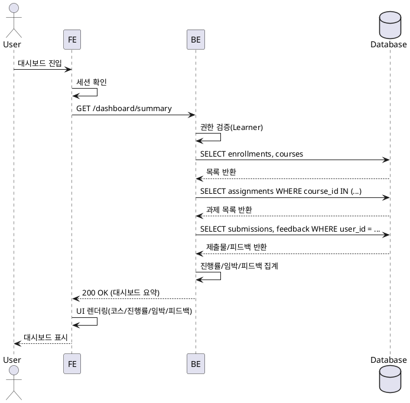

# 003 Learner 대시보드 — 상세 유스케이스

- Primary Actor: Learner(로그인 사용자)
- Precondition (사용자 관점):
  - 사용자는 유효한 계정으로 로그인 상태다.
  - 역할이 Learner로 설정되어 있다.
- Trigger:
  - 사용자가 대시보드 메뉴 또는 첫 진입 화면에서 대시보드를 연다.

## Main Scenario
1) FE가 사용자 세션을 확인하고 대시보드 데이터를 요청한다.
2) BE는 사용자 권한을 검증하고 Learner인지 확인한다.
3) BE는 DB에서 다음을 조회한다:
   - 사용자의 수강 코스(enrollments)와 각 코스의 과제 목록(assignments)
   - 사용자의 제출물(submissions)과 채점/피드백 기록(feedback)
4) BE는 정책에 따라 진행률(완료 과제 수/전체 과제 수)을 코스별로 계산한다.
5) BE는 마감 임박 과제를 식별하고(임박 기준: 설정값) 정렬한다.
6) BE는 최근 피드백(최신순, 제한 개수)을 요약한다.
7) BE는 대시보드 요약 데이터를 FE에 반환한다.
8) FE는 수신 데이터를 렌더링한다: 내 코스 목록, 진행률, 마감 임박 과제, 최근 피드백.

## Edge Cases
- 수강 코스 없음: 빈 상태 화면과 탐색 CTA 표시.
- 과제 없음: 진행률 0%로 표기, 임박 항목 비표시.
- 데이터 지연/부분 실패: FE는 스켈레톤/에러 토스트 표시, 재시도 버튼 제공.
- 권한 오류(비Learner): 접근 차단 및 역할 전환 안내.
- 시간대 이슈: 클라이언트 지역 시간대로 마감 표시(서버 UTC 기준 변환).
- 데이터 불일치(삭제/아카이브된 코스): 비표시 처리 및 로그 남김.

## Business Rules
- 진행률 = 완료 과제 수 / 전체 과제 수.
  - 완료는 제출물 상태가 graded 또는 제출 요건 충족 상태로 간주.
  - 전체 과제는 해당 코스의 published 상태 과제만 포함.
- 마감 임박 = 현재 시각부터 설정 임계치 이내(기본 72시간, 서버 설정값으로 변경 가능).
- 최근 피드백 = 최신순 상위 N개(기본 5개) 요약.
- 읽기 전용 집계로, 대시보드에서 상태 변경은 발생하지 않는다.
- 사용자 범위: 본인 데이터만 집계/노출.

## Sequence Diagram (PlantUML)

