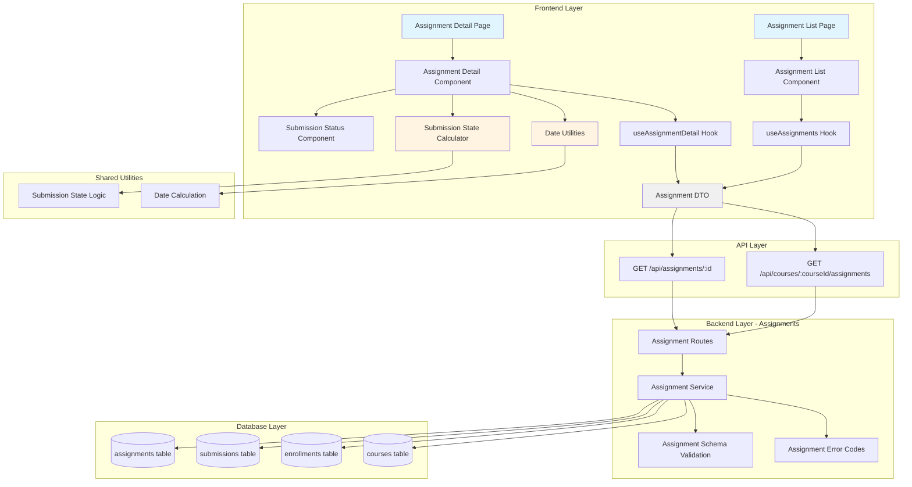

# Implementation Plan: Assignment Detail View (Learner)

## 개요

### Backend Modules

| Module | Location | Description |
|--------|----------|-------------|
| **Assignment Schema** | `src/features/assignments/backend/schema.ts` | Assignment 및 Submission 관련 요청/응답 스키마 (Zod) |
| **Assignment Service** | `src/features/assignments/backend/service.ts` | Assignment 조회, 권한 검증, Submission 상태 확인 비즈니스 로직 |
| **Assignment Routes** | `src/features/assignments/backend/route.ts` | Assignment API 엔드포인트 (GET /api/assignments/:id, GET /api/courses/:courseId/assignments) |
| **Assignment Error Codes** | `src/features/assignments/backend/error.ts` | Assignment 관련 에러 코드 정의 |

### Frontend Modules

| Module | Location | Description |
|--------|----------|-------------|
| **Assignment DTO** | `src/features/assignments/lib/dto.ts` | Backend schema 재노출 (타입 공유) |
| **Assignment Hooks** | `src/features/assignments/hooks/useAssignments.ts` | 코스별 과제 목록 조회 React Query 훅 |
| | `src/features/assignments/hooks/useAssignmentDetail.ts` | 과제 상세 조회 React Query 훅 |
| **Assignment Components** | `src/features/assignments/components/assignment-list.tsx` | 과제 목록 표시 컴포넌트 |
| | `src/features/assignments/components/assignment-card.tsx` | 개별 과제 카드 컴포넌트 |
| | `src/features/assignments/components/assignment-detail.tsx` | 과제 상세 정보 컴포넌트 |
| | `src/features/assignments/components/submission-status.tsx` | 제출 상태 표시 컴포넌트 |
| **Assignment Pages** | `src/app/my-courses/[courseId]/assignments/page.tsx` | 과제 목록 페이지 |
| | `src/app/my-courses/[courseId]/assignments/[assignmentId]/page.tsx` | 과제 상세 페이지 |

### Shared Modules

| Module | Location | Description |
|--------|----------|-------------|
| **Date Utilities** | `src/lib/date-utils.ts` | 마감일 계산, 지각 여부 판단, 날짜 포맷팅 유틸리티 |
| **Submission State Calculator** | `src/lib/submission-state.ts` | 제출 버튼 상태 계산 로직 (재사용 가능) |

---

## Diagram



---

## Implementation Plan

### Phase 1: Shared Utilities

#### 1.1 Date Utilities
**Location**: `src/lib/date-utils.ts`

**Purpose**: 마감일 계산, 지각 여부 판단, 날짜 포맷팅

**Implementation**:
```typescript
export const isAfterDeadline = (dueDate: string): boolean => {
  // Check if current time is after due date
};

export const isDueSoon = (dueDate: string, hoursThreshold: number = 24): boolean => {
  // Check if due date is within threshold hours
};

export const formatDueDate = (dueDate: string): string => {
  // Format due date in user's timezone
};

export const getTimeUntilDue = (dueDate: string): {
  days: number;
  hours: number;
  minutes: number;
  isPast: boolean;
} => {
  // Calculate time remaining until due date
};
```

**Unit Tests**:
- ✅ Returns true when current time is after due date
- ✅ Returns false when current time is before due date
- ✅ isDueSoon returns true for assignments due within 24 hours
- ✅ isDueSoon returns false for assignments due after 24 hours
- ✅ formatDueDate formats date in user's timezone
- ✅ getTimeUntilDue calculates correct time difference
- ✅ getTimeUntilDue sets isPast=true for past deadlines

---

#### 1.2 Submission State Calculator
**Location**: `src/lib/submission-state.ts`

**Purpose**: 제출 버튼 활성화 상태 및 메시지 계산

**Implementation**:
```typescript
export type SubmissionButtonState = {
  canSubmit: boolean;
  message: string | null;
  variant: 'default' | 'warning' | 'disabled';
};

export const calculateSubmissionState = (
  assignmentStatus: 'draft' | 'published' | 'closed',
  dueDate: string,
  allowLate: boolean,
  hasSubmission: boolean,
  submissionStatus?: 'submitted' | 'graded' | 'resubmission_required',
  allowResubmission?: boolean,
): SubmissionButtonState => {
  // BR-003: Submission Window logic
  // BR-004: Resubmission Policy logic
  // Return state with canSubmit, message, variant
};
```

**Unit Tests**:
- ✅ Closed assignment disables submission
- ✅ Draft assignment disables submission
- ✅ Before deadline allows submission
- ✅ After deadline with allow_late=true allows submission with warning
- ✅ After deadline with allow_late=false disables submission
- ✅ Existing submission with allow_resubmission=false disables submission
- ✅ Existing submission with allow_resubmission=true allows resubmission
- ✅ Resubmission_required status allows submission regardless of policy
- ✅ Graded submission disables resubmission

---

### Phase 2: Backend - Assignments

#### 2.1 Assignment Error Codes
**Location**: `src/features/assignments/backend/error.ts`

**Implementation**:
```typescript
export const assignmentErrorCodes = {
  notFound: 'ASSIGNMENT_NOT_FOUND',
  notPublished: 'ASSIGNMENT_NOT_PUBLISHED',
  notEnrolled: 'NOT_ENROLLED_IN_COURSE',
  unauthorized: 'UNAUTHORIZED',
  databaseError: 'DATABASE_ERROR',
} as const;

export type AssignmentServiceError =
  (typeof assignmentErrorCodes)[keyof typeof assignmentErrorCodes];
```

---

#### 2.2 Assignment Schema
**Location**: `src/features/assignments/backend/schema.ts`

**Implementation**:
```typescript
// Course assignments list query
export const CourseAssignmentsQuerySchema = z.object({
  courseId: z.coerce.number(),
});

// Assignment detail response
export const AssignmentDetailSchema = z.object({
  id: z.number(),
  courseId: z.number(),
  title: z.string(),
  description: z.string().nullable(),
  dueDate: z.string(),
  weight: z.number(),
  allowLate: z.boolean(),
  allowResubmission: z.boolean(),
  status: z.enum(['draft', 'published', 'closed']),
  createdAt: z.string(),
  updatedAt: z.string(),
  submission: z.object({
    id: z.number(),
    content: z.string(),
    link: z.string().nullable(),
    status: z.enum(['submitted', 'graded', 'resubmission_required']),
    isLate: z.boolean(),
    score: z.number().nullable(),
    feedback: z.string().nullable(),
    submittedAt: z.string(),
    gradedAt: z.string().nullable(),
  }).nullable(),
});

// Assignment list item
export const AssignmentListItemSchema = z.object({
  id: z.number(),
  title: z.string(),
  dueDate: z.string(),
  weight: z.number(),
  status: z.enum(['draft', 'published', 'closed']),
  hasSubmission: z.boolean(),
  submissionStatus: z.enum(['submitted', 'graded', 'resubmission_required']).nullable(),
});

export const AssignmentListResponseSchema = z.object({
  assignments: z.array(AssignmentListItemSchema),
});
```

---

#### 2.3 Assignment Service
**Location**: `src/features/assignments/backend/service.ts`

**Implementation**:
```typescript
/**
 * Get assignments for a course (learner view)
 * BR-001: Only published assignments visible
 * BR-002: Must be enrolled in course
 */
export const getCourseAssignments = async (
  client: SupabaseClient,
  courseId: number,
  userId: string,
): Promise<HandlerResult<AssignmentListResponse, AssignmentServiceError, unknown>> => {
  // 1. Verify enrollment
  // 2. Fetch published assignments for course
  // 3. Check if user has submissions for each assignment
  // 4. Return assignment list with submission status
};

/**
 * Get assignment detail with submission
 * BR-001: Only published assignments
 * BR-002: Must be enrolled in course
 */
export const getAssignmentDetail = async (
  client: SupabaseClient,
  assignmentId: number,
  userId: string,
): Promise<HandlerResult<AssignmentDetail, AssignmentServiceError, unknown>> => {
  // 1. Fetch assignment
  // 2. Verify assignment is published
  // 3. Verify user is enrolled in course
  // 4. Fetch user's submission (if exists)
  // 5. Return assignment with submission data
};
```

**Unit Tests**:
- ✅ Returns only published assignments for enrolled course
- ✅ Returns 403 if not enrolled in course
- ✅ Returns assignments with submission status
- ✅ Assignment detail returns 404 if not found
- ✅ Assignment detail returns 403 if not published
- ✅ Assignment detail returns 403 if not enrolled
- ✅ Assignment detail includes submission data if exists
- ✅ Assignment detail returns null submission if not submitted

---

#### 2.4 Assignment Routes
**Location**: `src/features/assignments/backend/route.ts`

**Implementation**:
```typescript
export const registerAssignmentRoutes = (app: Hono<AppEnv>) => {
  // GET /api/courses/:courseId/assignments - List assignments
  app.get('/api/courses/:courseId/assignments', async (c) => {
    // Extract userId from auth
    // Validate courseId param
    // Call getCourseAssignments service
    // Return response
  });

  // GET /api/assignments/:id - Assignment detail
  app.get('/api/assignments/:id', async (c) => {
    // Extract userId from auth
    // Validate assignmentId param
    // Call getAssignmentDetail service
    // Return response
  });
};
```

---

### Phase 3: Frontend - DTO & Hooks

#### 3.1 Assignment DTO
**Location**: `src/features/assignments/lib/dto.ts`

**Implementation**:
```typescript
export {
  AssignmentDetailSchema,
  AssignmentListItemSchema,
  AssignmentListResponseSchema,
  type AssignmentDetail,
  type AssignmentListItem,
  type AssignmentListResponse,
} from '@/features/assignments/backend/schema';
```

---

#### 3.2 Assignment Hooks
**Location**: `src/features/assignments/hooks/useAssignments.ts`

**Implementation**:
```typescript
export const useAssignments = (courseId: number) => {
  return useQuery({
    queryKey: ['assignments', courseId],
    queryFn: async () => {
      const { data } = await apiClient.get(
        `/api/courses/${courseId}/assignments`
      );
      return AssignmentListResponseSchema.parse(data);
    },
    enabled: !!courseId,
  });
};
```

**Location**: `src/features/assignments/hooks/useAssignmentDetail.ts`

**Implementation**:
```typescript
export const useAssignmentDetail = (assignmentId: number) => {
  return useQuery({
    queryKey: ['assignment', assignmentId],
    queryFn: async () => {
      const { data } = await apiClient.get(`/api/assignments/${assignmentId}`);
      return AssignmentDetailSchema.parse(data);
    },
    enabled: !!assignmentId,
  });
};
```

---

### Phase 4: Frontend - Components

#### 4.1 Assignment Card Component
**Location**: `src/features/assignments/components/assignment-card.tsx`

**Purpose**: 과제 목록 개별 항목 표시

**QA Sheet**:
- [ ] Displays assignment title
- [ ] Shows due date with time-until-due indicator
- [ ] Shows weight percentage
- [ ] Displays submission status badge (not submitted/submitted/graded)
- [ ] Shows "Due soon" indicator for assignments within 24 hours
- [ ] Shows "Overdue" indicator for past deadlines
- [ ] Click navigates to assignment detail page
- [ ] Hover effect indicates clickability
- [ ] Responsive layout on mobile/tablet/desktop

**Required Shadcn Components**:
```bash
npx shadcn@latest add badge
```

---

#### 4.2 Assignment List Component
**Location**: `src/features/assignments/components/assignment-list.tsx`

**Purpose**: 과제 목록 표시

**QA Sheet**:
- [ ] Renders list of assignment cards
- [ ] Shows loading state while fetching
- [ ] Shows empty state if no assignments
- [ ] Shows error state on fetch failure
- [ ] Groups assignments by status (upcoming, overdue, completed)
- [ ] Sorts by due date ascending within groups
- [ ] Responsive grid layout

**Required Shadcn Components**:
```bash
npx shadcn@latest add skeleton
```

---

#### 4.3 Submission Status Component
**Location**: `src/features/assignments/components/submission-status.tsx`

**Purpose**: 제출 상태 표시 (제출 여부, 점수, 피드백)

**QA Sheet**:
- [ ] Shows "Not submitted" state with empty form
- [ ] Shows "Submitted" state with content preview
- [ ] Shows "Graded" state with score and feedback
- [ ] Shows "Resubmission required" state with warning
- [ ] Displays submission timestamp
- [ ] Shows late submission indicator
- [ ] Formats content with line breaks preserved
- [ ] Displays link as clickable anchor if provided
- [ ] Shows feedback in expandable section if long

---

#### 4.4 Assignment Detail Component
**Location**: `src/features/assignments/components/assignment-detail.tsx`

**Purpose**: 과제 상세 정보 및 제출 UI

**QA Sheet**:
- [ ] Displays assignment title and description
- [ ] Shows due date in user's timezone
- [ ] Displays score weight percentage
- [ ] Shows late submission policy indicator
- [ ] Shows resubmission policy indicator
- [ ] Displays submission status component
- [ ] Submit button state calculated correctly (enabled/disabled/warning)
- [ ] Submit button shows appropriate message based on state
- [ ] Closed assignment shows "Assignment closed" message
- [ ] Overdue assignment with allow_late=false shows "Deadline passed"
- [ ] Overdue assignment with allow_late=true shows "Late submission" warning
- [ ] Form disabled when submission not allowed
- [ ] Submission content and link fields visible

**Required Shadcn Components**:
```bash
npx shadcn@latest add alert
npx shadcn@latest add textarea
```

---

### Phase 5: Frontend - Pages

#### 5.1 Assignment List Page
**Location**: `src/app/my-courses/[courseId]/assignments/page.tsx`

**Purpose**: 코스별 과제 목록 페이지

**QA Sheet**:
- [ ] Loads assignments for course from route params
- [ ] Shows course title in header
- [ ] Displays assignment list component
- [ ] Back button navigates to my courses
- [ ] Shows 404 if course not found
- [ ] Shows access denied if not enrolled
- [ ] Responsive layout on all devices
- [ ] Page title includes course name

---

#### 5.2 Assignment Detail Page
**Location**: `src/app/my-courses/[courseId]/assignments/[assignmentId]/page.tsx`

**Purpose**: 과제 상세 페이지

**QA Sheet**:
- [ ] Fetches assignment detail from route params
- [ ] Shows assignment detail component
- [ ] Back button navigates to assignment list
- [ ] Shows 404 if assignment not found
- [ ] Shows 403 if not enrolled or not published
- [ ] Breadcrumb navigation (Course > Assignments > Assignment Title)
- [ ] Page title is assignment title
- [ ] Meta description is assignment description excerpt

---

## Implementation Order

1. **Phase 1**: Shared utilities (Date Utils, Submission State Calculator)
2. **Phase 2**: Backend - Assignments (Schema → Error → Service → Routes)
3. **Phase 3**: Frontend - DTO & Hooks
4. **Phase 4**: Frontend - Components (Card → List → Submission Status → Detail)
5. **Phase 5**: Frontend - Pages (List → Detail)
6. **Integration**: Register Hono routes in app.ts

---

## Testing Strategy

### Backend Unit Tests
- Use Vitest for unit testing
- Mock Supabase client responses
- Test all business rules (BR-001 through BR-006)
- Test enrollment validation
- Test submission state logic
- Target: >80% coverage

### Frontend QA Checklists
- Manual QA using provided sheets
- Focus on submission button state calculation
- Test due date display and timezone handling
- Test all assignment states (draft, published, closed)
- Test submission states (not submitted, submitted, graded, resubmission_required)

### Integration Testing
- Test full user flow: Course → Assignments → Assignment Detail
- Test with real Supabase instance (development)
- Verify enrollment validation
- Verify assignment visibility rules
- Test submission window logic
