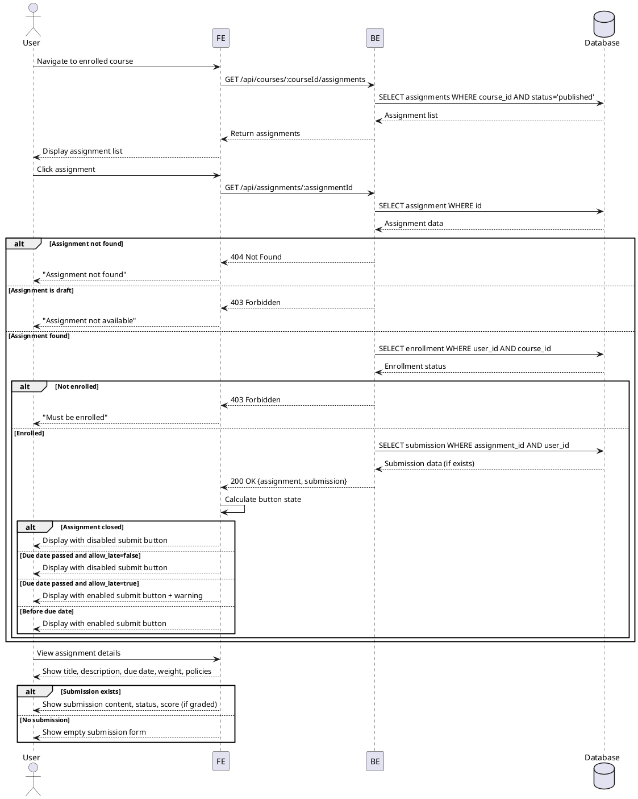

# Use Case Specification: Assignment Detail View (Learner)

## Primary Actor
Learner (authenticated user with `role=learner`)

## Preconditions
- User is authenticated and has `role=learner`
- User is enrolled in at least one course
- At least one assignment exists in the enrolled course

## Trigger
User navigates to assignment list from enrolled course and clicks on an assignment

## Main Scenario

### 1. Navigate to Assignment
1. User accesses "My Courses" page
2. User selects an enrolled course
3. System displays assignment list for the course
4. User clicks on an assignment to view details

### 2. View Assignment Details
1. System validates user enrollment in the course
2. System checks assignment status is `published`
3. System retrieves assignment information:
   - Title and description
   - Due date and time
   - Score weight (percentage of total course grade)
   - Late submission policy (allow_late)
   - Resubmission policy (allow_resubmission)
4. System displays assignment details
5. System shows submission UI (text field + optional link field)

### 3. Check Submission Status
1. System checks if user has existing submission
2. If submission exists:
   - Display submission content and link
   - Display submission status (submitted/graded/resubmission_required)
   - Display whether submission was late
   - If graded, display score and feedback
3. If no submission exists:
   - Display empty submission form

### 4. Determine Submit Button State
1. If assignment status is `closed`:
   - Disable submit button
   - Display "Assignment closed" message
2. If assignment status is `published` and due date not passed:
   - Enable submit button
3. If due date passed:
   - If `allow_late = true`: Enable submit button with "Late submission" warning
   - If `allow_late = false`: Disable submit button with "Deadline passed" message

## Edge Cases

### Assignment Not Found
- **Condition**: Assignment ID does not exist
- **Response**: Display "Assignment not found" error, redirect to course page

### Assignment Not Published
- **Condition**: Assignment status is `draft`
- **Response**: Display "This assignment is not available yet"

### Not Enrolled in Course
- **Condition**: User is not enrolled in the course that owns this assignment
- **Response**: Display "You must be enrolled in this course to view this assignment", redirect to course catalog

### Assignment Closed
- **Condition**: Assignment status is `closed`
- **Response**: Display assignment details but disable submission, show "This assignment is closed"

### Network Errors
- **Condition**: API request fails
- **Response**: Display "Failed to load assignment details. Please try again."

### Unauthorized Access
- **Condition**: User is not authenticated or not a learner
- **Response**: Redirect to login page or display "Access denied"

## Business Rules

### BR-001: Assignment Visibility
Only assignments with `status=published` can be viewed by learners. Draft assignments are hidden.

### BR-002: Enrollment Validation
Learners can only view assignments from courses they are enrolled in.

### BR-003: Submission Window
- Before due date: Submission allowed
- After due date with `allow_late=true`: Late submission allowed with `is_late=true` flag
- After due date with `allow_late=false`: Submission blocked
- Assignment status `closed`: Submission blocked regardless of due date

### BR-004: Resubmission Policy
- If `allow_resubmission=true`: Learner can update submission before deadline
- If `allow_resubmission=false`: Once submitted, cannot be modified
- If status is `resubmission_required`: Learner can resubmit regardless of policy

### BR-005: Assignment Information Display
Display must include:
- Assignment title and description (required)
- Due date in learner's timezone (required)
- Score weight as percentage (required)
- Late submission policy indicator (required)
- Resubmission policy indicator (required)

### BR-006: Submission Status Display
If submission exists, display:
- Submission content and link
- Submission timestamp
- Late submission indicator (if applicable)
- Current status (submitted/graded/resubmission_required)
- Score and feedback (if graded)

---

## Sequence Diagram

