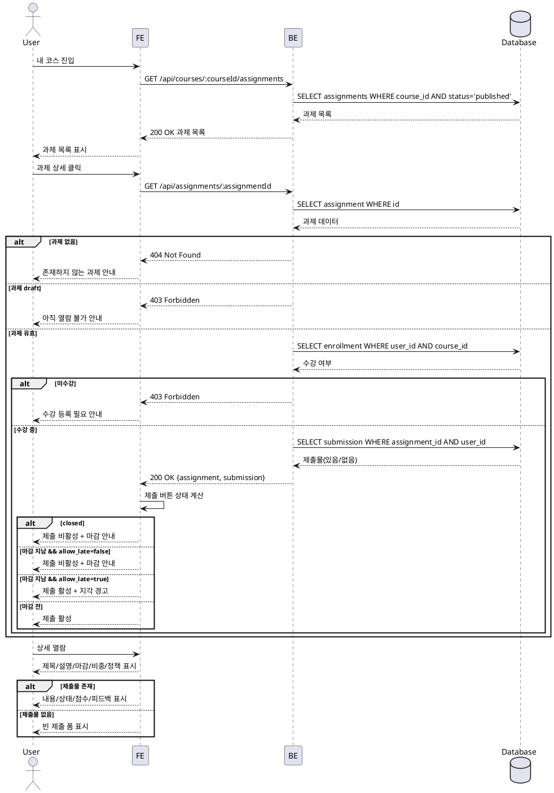

# Use Case: 과제 상세 열람 (Learner)

## Primary Actor
- 학습자(Learner)

## Precondition (사용자 관점)
- 로그인 상태이며 역할이 Learner이다.
- 해당 코스에 수강 등록되어 있다.

## Trigger
- 내 코스 → 과제 목록에서 특정 과제를 클릭한다.

## Main Scenario
1. 사용자는 내 코스에서 코스를 선택한다.
2. 시스템은 코스의 과제 목록을 표시한다.
3. 사용자는 과제 상세를 클릭한다.
4. 시스템은 수강 등록 여부를 확인한다.
5. 시스템은 과제 상태가 `published`인지 확인한다.
6. 시스템은 과제 정보(제목/설명, 마감일, 점수 비중, 지각/재제출 정책)를 조회하여 표시한다.
7. 시스템은 제출 UI(텍스트 필수, 링크 선택)를 함께 표시한다.
8. 시스템은 기존 제출물이 있으면 상태/점수/피드백을 함께 표시한다.
9. 시스템은 상태/정책/마감 기준으로 제출 버튼 활성/비활성 및 경고 문구를 결정한다.

## Edge Cases (간략 처리)
- 과제를 찾을 수 없음: "존재하지 않는 과제" 안내 후 코스 페이지로 복귀.
- 미게시(draft) 과제: "아직 열람 불가" 안내.
- 미수강 코스: "수강 등록 필요" 안내 후 카탈로그로 유도.
- 마감/종료(closed): 상세는 보이되 제출 비활성 및 안내.
- 인증/권한 오류: 로그인 또는 접근 권한 안내.
- 네트워크/서버 오류: "불러오기 실패" 재시도 안내.

## Business Rules
- BR-001 가시성: `status=published`인 과제만 Learner에게 노출/열람 가능.
- BR-002 수강 검증: 수강 등록된 코스의 과제만 열람 가능.
- BR-003 제출 창: 
  - 마감 전: 제출 가능
  - 마감 후 `allow_late=true`: 지각 제출 허용(`is_late=true`)
  - 마감 후 `allow_late=false`: 제출 차단
  - `closed`: 마감 여부와 무관하게 제출 차단
- BR-004 재제출 정책:
  - `allow_resubmission=true`: 마감 전 수정 가능
  - `allow_resubmission=false`: 최초 제출 후 수정 불가
  - `resubmission_required` 상태면 정책과 무관하게 재제출 가능
- BR-005 표시 항목: 제목/설명, 학습자 타임존 기준 마감일, 점수 비중, 지각/재제출 정책은 필수로 표시.
- BR-006 제출 상태 표시: 제출물 존재 시 내용/링크, 제출시각, 지각 여부, 상태(submitted/graded/resubmission_required), 점수/피드백(채점 시)을 표시.

## Sequence Diagram

