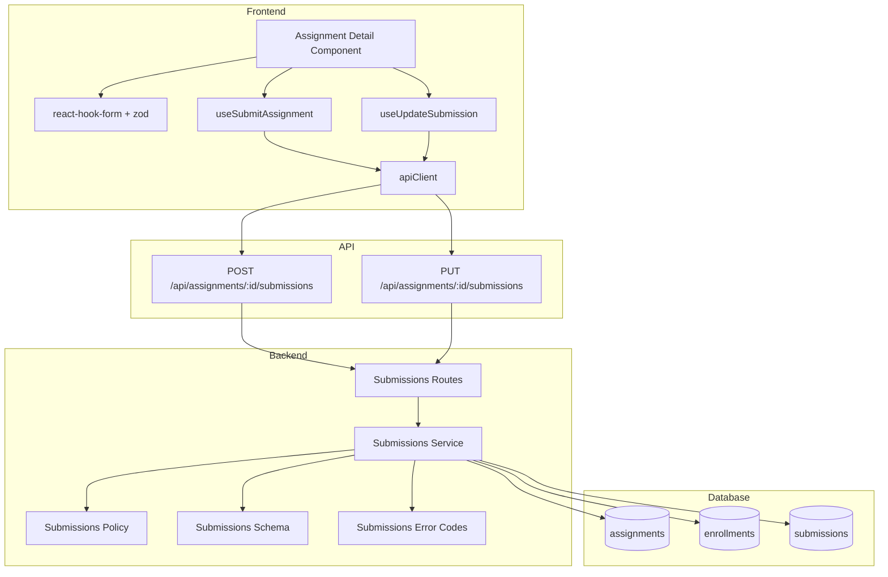

# Implementation Plan: 과제 제출/재제출 (Learner)

## 개요

- Submissions Error Codes — `src/features/submissions/backend/error.ts`
  - 제출/재제출 도메인 에러 코드 정의(VALIDATION_ERROR, UNAUTHORIZED, NOT_ENROLLED, NOT_PUBLISHED, DEADLINE_PASSED, RESUBMISSION_NOT_ALLOWED, GRADED_LOCKED, DATABASE_ERROR 등)
- Submissions Schema — `src/features/submissions/backend/schema.ts`
  - Request: `SubmitRequestSchema`(content, link?)
  - Response: `SubmissionSchema`(id, status, isLate, score?, feedback?, submittedAt, gradedAt)
- Submissions Policy — `src/features/submissions/backend/policy.ts`
  - BR-003/BR-004에 따른 서버측 제출 가능 여부 판단(마감/지각/재제출 규칙)
- Submissions Service — `src/features/submissions/backend/service.ts`
  - `createSubmission(client, userId, assignmentId, payload)`
  - `updateSubmission(client, userId, assignmentId, payload)`
  - 과제 게시/수강 검증, 마감/지각/재제출 판단, DB insert/update
- Submissions Routes — `src/features/submissions/backend/route.ts`
  - `POST /api/assignments/:id/submissions`(최초 제출)
  - `PUT /api/assignments/:id/submissions`(재제출)
  - Authorization Bearer 처리(getSupabase, respond 사용)
- DTO 재노출 — `src/features/submissions/lib/dto.ts`
  - 프런트에서 사용할 타입/스키마 재노출
- Hooks — `src/features/submissions/hooks/useSubmitAssignment.ts`
  - `useSubmitAssignment(assignmentId)` — POST
  - `useUpdateSubmission(assignmentId)` — PUT
  - `@/lib/remote/api-client` 경유, Authorization 헤더 첨부, `@tanstack/react-query` mutation
- UI 통합 — `src/features/assignments/components/assignment-detail.tsx`
  - react-hook-form + zod-resolver로 제출 폼 유효성 검증, mutation 바인딩
  - 제출 버튼 상태는 기존 `calculateSubmissionState` 유지, 성공 시 상세 refetch

## Diagram



## Implementation Plan

### Backend

1) Error Codes — `src/features/submissions/backend/error.ts`
```ts
export const submissionErrorCodes = {
  validationError: 'VALIDATION_ERROR',
  unauthorized: 'UNAUTHORIZED',
  notFound: 'SUBMISSION_NOT_FOUND',
  notPublished: 'ASSIGNMENT_NOT_PUBLISHED',
  notEnrolled: 'NOT_ENROLLED_IN_COURSE',
  deadlinePassed: 'DEADLINE_PASSED',
  resubmissionNotAllowed: 'RESUBMISSION_NOT_ALLOWED',
  gradedLocked: 'GRADED_LOCKED',
  databaseError: 'DATABASE_ERROR',
} as const;
export type SubmissionErrorCode = (typeof submissionErrorCodes)[keyof typeof submissionErrorCodes];
```

2) Schema — `src/features/submissions/backend/schema.ts`
```ts
import { z } from 'zod';
export const SubmitRequestSchema = z.object({
  content: z.string().min(1, 'Content is required'),
  link: z.string().url().optional().or(z.literal('').transform(() => undefined)),
});
export const SubmissionSchema = z.object({
  id: z.number(),
  assignmentId: z.number(),
  userId: z.string(),
  status: z.enum(['submitted', 'graded', 'resubmission_required']),
  isLate: z.boolean(),
  score: z.number().nullable(),
  feedback: z.string().nullable(),
  submittedAt: z.string(),
  gradedAt: z.string().nullable(),
});
export type SubmitRequest = z.infer<typeof SubmitRequestSchema>;
export type Submission = z.infer<typeof SubmissionSchema>;
```

3) Policy — `src/features/submissions/backend/policy.ts`
```ts
import { isAfter } from 'date-fns';
export const canSubmit = (opts: {
  assignmentStatus: 'draft' | 'published' | 'closed';
  dueDate: string; // ISO
  allowLate: boolean;
}): { allowed: boolean; reason?: 'NOT_PUBLISHED'|'CLOSED'|'DEADLINE_PASSED' } => {
  if (opts.assignmentStatus === 'draft') return { allowed: false, reason: 'NOT_PUBLISHED' };
  if (opts.assignmentStatus === 'closed') return { allowed: false, reason: 'CLOSED' };
  const past = isAfter(new Date(), new Date(opts.dueDate));
  if (past && !opts.allowLate) return { allowed: false, reason: 'DEADLINE_PASSED' };
  return { allowed: true };
};
export const canResubmit = (opts: {
  submissionStatus?: 'submitted'|'graded'|'resubmission_required';
  allowResubmission: boolean;
}): { allowed: boolean; reason?: 'GRADED_LOCKED'|'RESUBMISSION_NOT_ALLOWED' } => {
  if (opts.submissionStatus === 'graded') return { allowed: false, reason: 'GRADED_LOCKED' };
  if (opts.submissionStatus === 'resubmission_required') return { allowed: true };
  if (!opts.allowResubmission) return { allowed: false, reason: 'RESUBMISSION_NOT_ALLOWED' };
  return { allowed: true };
};
```

4) Service — `src/features/submissions/backend/service.ts`
- `createSubmission(client, userId, assignmentId, payload)`
  - 과제 조회(draft/closed 차단, published만), 수강 등록 검증, 기존 제출 존재 여부 확인
  - `canSubmit` 판정 후 마감 지남이면 `is_late=true`
  - submissions INSERT(status='submitted', is_late)
  - 성공 시 `SubmissionSchema` 형태로 반환
- `updateSubmission(client, userId, assignmentId, payload)`
  - 기존 제출 조회 없으면 404, 있으면 `canResubmit`/`canSubmit` 판정
  - 허용 시 content/link 갱신, status='submitted', is_late 재계산 후 UPDATE

Unit Tests (목록)
- published/draft/closed별 `canSubmit` 동작
- 마감 후 allow_late true/false 케이스
- graded/resubmission_required/allowResubmission 조합의 `canResubmit`
- 최초 제출: 이미 제출 존재 시 409
- 재제출: graded 잠금/정책 불가/허용 케이스
- 수강 미등록/과제 없음/DB 오류 시 에러 코드 매핑

5) Routes — `src/features/submissions/backend/route.ts`
```ts
// POST /api/assignments/:id/submissions
// PUT  /api/assignments/:id/submissions
// - Authorization Bearer 추출 → supabase.auth.getUser(token)
// - params(id) 정수 검증 → 실패 시 VALIDATION_ERROR
// - body zod 검증(SubmitRequestSchema)
// - service 호출 후 respond()
```
- `src/backend/hono/app.ts`에 `registerSubmissionRoutes(app)` 등록

### Frontend

6) DTO 재노출 — `src/features/submissions/lib/dto.ts`
```ts
export { SubmitRequestSchema, SubmissionSchema, type SubmitRequest, type Submission } from '@/features/submissions/backend/schema';
```

7) 훅 — `src/features/submissions/hooks/useSubmitAssignment.ts`
```ts
'use client';
import { useMutation, useQueryClient } from '@tanstack/react-query';
import { apiClient, extractApiErrorMessage } from '@/lib/remote/api-client';
import { SubmitRequestSchema, type SubmitRequest, SubmissionSchema } from '@/features/submissions/lib/dto';

const withAuth = () => {
  let headers: Record<string, string> | undefined;
  if (typeof window !== 'undefined') {
    const token = localStorage.getItem('auth_token');
    if (token) headers = { Authorization: `Bearer ${token}` };
  }
  return { headers } as const;
};

export const useSubmitAssignment = (assignmentId: number) => {
  const qc = useQueryClient();
  return useMutation({
    mutationFn: async (payload: SubmitRequest) => {
      const parsed = SubmitRequestSchema.parse(payload);
      const { headers } = withAuth();
      const { data } = await apiClient.post(`/api/assignments/${assignmentId}/submissions`, parsed, { headers });
      return SubmissionSchema.parse(data);
    },
    onSuccess: () => {
      qc.invalidateQueries({ queryKey: ['assignments'] });
      qc.invalidateQueries({ queryKey: ['assignment', assignmentId] });
    },
    onError: (e) => { throw new Error(extractApiErrorMessage(e, '제출에 실패했습니다.')); },
  });
};

export const useUpdateSubmission = (assignmentId: number) => {
  const qc = useQueryClient();
  return useMutation({
    mutationFn: async (payload: SubmitRequest) => {
      const parsed = SubmitRequestSchema.parse(payload);
      const { headers } = withAuth();
      const { data } = await apiClient.put(`/api/assignments/${assignmentId}/submissions`, parsed, { headers });
      return SubmissionSchema.parse(data);
    },
    onSuccess: () => {
      qc.invalidateQueries({ queryKey: ['assignment', assignmentId] });
    },
    onError: (e) => { throw new Error(extractApiErrorMessage(e, '재제출에 실패했습니다.')); },
  });
};
```

8) UI 통합 — `src/features/assignments/components/assignment-detail.tsx`
- react-hook-form + zodResolver로 폼 구성(content 필수, link URL)
- `calculateSubmissionState`에 따라 버튼 활성/비활성 유지
- `assignment.submission` 존재 여부로 `useSubmitAssignment` vs `useUpdateSubmission` 선택 바인딩
- 성공 시 Alert로 피드백, react-query refetch로 상세 갱신

QA Sheet (Presentation)
- [ ] 텍스트 필수/링크 URL 검증 에러 메시지 표시
- [ ] 최초 제출 성공 후 상태/시각/지각 표시 갱신
- [ ] 재제출 성공 후 상태/시각 업데이트
- [ ] 마감 이후 allow_late=false에서는 버튼 비활성 및 안내
- [ ] graded 상태에서는 재제출 버튼 비활성 안내
- [ ] resubmission_required면 경고 배지/문구 노출 및 재제출 가능
- [ ] 네트워크 오류 시 사용자 친화적 메시지와 재시도 제공

### Pages (검증)
- 기존 page.tsx는 모두 `"use client"` 및 `params: Promise<...>` 패턴 유지
- 제출 성공 시 상세 페이지에서 즉시 반영(react-query 무효화)

### Integration
- `src/backend/hono/app.ts`에 `registerSubmissionRoutes(app)` 호출 추가
- 새 모듈 전역 타입/린트/빌드 통과 확인

## Testing Strategy

- 단위 테스트(비즈니스 로직): submissions/backend/policy.ts, service.ts
  - canSubmit/canResubmit 케이스 전수(마감/지각/등급/정책)
  - DB 오류/미수강/미게시 케이스
- 프런트 QA: 폼 검증/버튼 상태/성공/실패 흐름
- 통합: POST/PUT → 상세 refetch → UI 반영 검증
