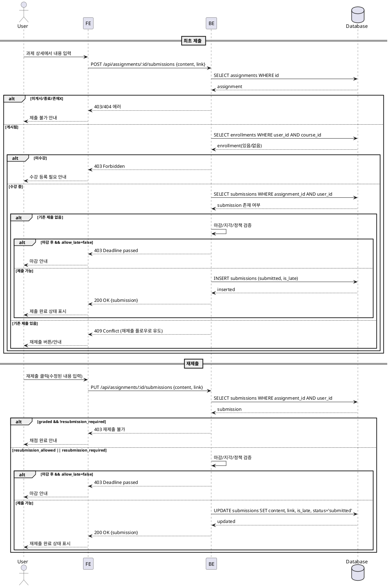

# Use Case: 과제 제출/재제출 (Learner)

## Primary Actor
- 학습자(Learner)

## Precondition (사용자 관점)
- 로그인 상태이며 역할이 Learner이다.
- 해당 코스에 수강 등록되어 있다.
- 과제 상세 화면에 접근 가능한 상태(게시됨 `published`).

## Trigger
- 과제 상세 화면에서 제출 버튼을 클릭한다(최초 제출 또는 재제출).

## Main Scenario
1. 사용자는 과제 상세 화면에서 텍스트(필수)와 링크(선택)를 입력한다.
2. 시스템은 입력값을 검증한다(텍스트 비어있지 않음, 링크는 URL 형식).
3. 시스템은 제출 가능 여부를 판단한다(BR-001, BR-002, BR-003, BR-004).
4. 최초 제출인 경우 제출 레코드를 생성한다.
5. 재제출 가능한 경우 기존 제출을 업데이트한다.
6. 마감 이후 `allow_late=true`이면 지각 플래그를 설정한다.
7. 성공 시 현재 제출 상태/시각/지각 여부를 갱신하여 표시한다.

## Edge Cases (간략 처리)
- 입력 오류: 텍스트 누락/링크 형식 오류 → 필드 오류 표시, 제출 차단.
- 과제 미게시/종료: `draft/closed` → 안내 문구 표시, 제출 비활성.
- 미수강/권한 오류: "수강 등록 필요" 또는 "권한 없음" 안내.
- 마감 경과(`allow_late=false`): 제출 차단 및 마감 안내.
- 이미 채점 완료(`graded`): 재제출 차단. 단, `resubmission_required`면 허용.
- 네트워크/서버 오류: "제출 실패" 재시도 안내.

## Business Rules
- BR-001 가시성: `status=published`인 과제만 제출 가능 검토 대상.
- BR-002 수강 검증: 수강 등록된 사용자만 제출 가능.
- BR-003 제출 창:
  - 마감 전: 제출 가능.
  - 마감 후 `allow_late=true`: 제출 가능(`is_late=true`).
  - 마감 후 `allow_late=false`: 제출 차단.
  - `closed`: 제출 차단.
- BR-004 재제출 정책:
  - `allow_resubmission=true`: 마감 전 수정 가능.
  - `allow_resubmission=false`: 최초 제출 후 수정 불가.
  - `resubmission_required` 상태면 정책과 무관하게 재제출 가능.
- BR-005 입력 유효성: 텍스트 필수, 링크는 URL 형식(선택).
- BR-006 상태 전이: 최초 제출 → `submitted`; 채점 시 `graded`; 강사 요청 시 `resubmission_required`.

## Sequence Diagram

