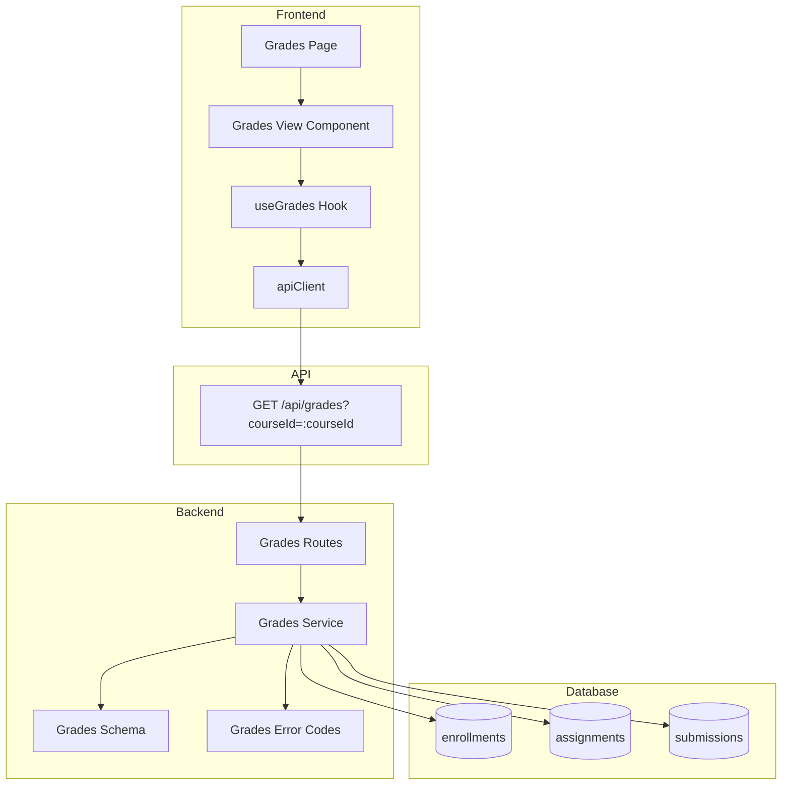

# Implementation Plan: 성적 & 피드백 열람 (Learner)

## 개요

- Grades Schema — `src/features/grades/backend/schema.ts`
  - 요청/응답 zod 스키마 정의: 코스별 성적 요약(total) 및 과제별 상세(점수/상태/지각/피드백)
- Grades Service — `src/features/grades/backend/service.ts`
  - 수강 여부 검증 → 과제/제출물 조인 → 총점 계산(BR-003) → 응답 매핑
- Grades Routes — `src/features/grades/backend/route.ts`
  - `GET /api/grades?courseId=:courseId` (Authorization Bearer)
- Grades Error Codes — `src/features/grades/backend/error.ts`
  - `UNAUTHORIZED`, `NOT_ENROLLED`, `DATABASE_ERROR`, `VALIDATION_ERROR`
- DTO 재노출 — `src/features/grades/lib/dto.ts`
  - 프런트 훅/컴포넌트가 사용할 타입/스키마 재노출
- Hook — `src/features/grades/hooks/useGrades.ts`
  - `useGrades(courseId)`; `@/lib/remote/api-client` + `@tanstack/react-query`
- Components — `src/features/grades/components/grades-view.tsx`
  - 코스 총점/과제별 상세/피드백 섹션 표시(“use client”)
- Page — `src/app/my-courses/[courseId]/grades/page.tsx`
  - params: Promise<{ courseId }> 패턴, Hook로 데이터 로딩 및 표시
- Shared — `src/lib/date-utils.ts`
  - 날짜 포맷/타임존 처리 재사용(이미 존재)

## Diagram



## Implementation Plan

### Backend

1) Error Codes — `src/features/grades/backend/error.ts`
```ts
export const gradesErrorCodes = {
  unauthorized: 'UNAUTHORIZED',
  notEnrolled: 'NOT_ENROLLED_IN_COURSE',
  validationError: 'VALIDATION_ERROR',
  databaseError: 'DATABASE_ERROR',
} as const;
export type GradesServiceError = keyof typeof gradesErrorCodes;
```

2) Schema — `src/features/grades/backend/schema.ts`
```ts
import { z } from 'zod';
export const GradesQuerySchema = z.object({ courseId: z.coerce.number() });
export const GradeItemSchema = z.object({
  assignmentId: z.number(),
  title: z.string(),
  weight: z.number(),
  status: z.enum(['submitted','graded','resubmission_required']).nullable(),
  isLate: z.boolean().nullable(),
  score: z.number().nullable(),
  feedback: z.string().nullable(),
  submittedAt: z.string().nullable(),
  gradedAt: z.string().nullable(),
});
export const GradesResponseSchema = z.object({
  courseId: z.number(),
  total: z.number(),
  items: z.array(GradeItemSchema),
});
export type GradesQuery = z.infer<typeof GradesQuerySchema>;
export type GradesResponse = z.infer<typeof GradesResponseSchema>;
```

3) Service — `src/features/grades/backend/service.ts`
```ts
import type { SupabaseClient } from '@supabase/supabase-js';
import { success, failure, type HandlerResult } from '@/backend/http/response';
import { gradesErrorCodes, type GradesServiceError } from './error';
import type { GradesResponse } from './schema';

export const getGrades = async (
  client: SupabaseClient,
  userId: string,
  courseId: number,
): Promise<HandlerResult<GradesResponse, GradesServiceError, unknown>> => {
  // 1) 수강 검증
  // 2) 과제(해당 코스) 조회
  // 3) 제출물(사용자, assignment_id in ...) 조회
  // 4) 과제별 점수/상태/지각/피드백 매핑
  // 5) 총점 = Σ(score × weight/100), 점수 없으면 0 간주
  // 6) 성공 응답 반환
};
```

Unit Tests (Service)
- ✅ 미수강 시 403 notEnrolled
- ✅ DB 오류 시 databaseError
- ✅ 과제/제출물 매핑 정확성(상태/점수/지각/피드백/시각)
- ✅ 총점 계산(점수 null→0, weight 반영)
- ✅ Empty 상태에서 total=0, items=[]

4) Routes — `src/features/grades/backend/route.ts`
```ts
import type { Hono } from 'hono';
import { failure, respond } from '@/backend/http/response';
import { getSupabase, getLogger, type AppEnv } from '@/backend/hono/context';
import { GradesQuerySchema, GradesResponseSchema } from './schema';
import { gradesErrorCodes } from './error';
import { getGrades } from './service';

export const registerGradesRoutes = (app: Hono<AppEnv>) => {
  app.get('/api/grades', async (c) => {
    const supabase = getSupabase(c);
    const logger = getLogger(c);

    const authHeader = c.req.header('Authorization');
    if (!authHeader?.startsWith('Bearer ')) {
      return respond(c, failure(401, gradesErrorCodes.unauthorized, 'Unauthorized'));
    }
    const token = authHeader.substring(7);
    const auth = await supabase.auth.getUser(token);
    if (auth.error || !auth.data.user) {
      return respond(c, failure(401, gradesErrorCodes.unauthorized, 'Unauthorized'));
    }

    const parsed = GradesQuerySchema.safeParse(c.req.query());
    if (!parsed.success) {
      return respond(c, failure(400, gradesErrorCodes.validationError, 'Invalid query', parsed.error.format()));
    }

    const result = await getGrades(supabase, auth.data.user.id, parsed.data.courseId);
    if (!result.ok) logger.error('Failed to fetch grades', JSON.stringify(result));
    return respond(c, result);
  });
};
```

5) Hono 등록 — `src/backend/hono/app.ts`
- `registerGradesRoutes(app)` 추가

### Frontend

6) DTO 재노출 — `src/features/grades/lib/dto.ts`
```ts
export {
  GradesQuerySchema,
  GradesResponseSchema,
  type GradesQuery,
  type GradesResponse,
} from '@/features/grades/backend/schema';
```

7) Hook — `src/features/grades/hooks/useGrades.ts`
```ts
'use client';
import { useQuery } from '@tanstack/react-query';
import { apiClient, extractApiErrorMessage } from '@/lib/remote/api-client';
import { GradesResponseSchema, type GradesResponse } from '@/features/grades/lib/dto';

const withAuth = () => {
  let headers: Record<string, string> | undefined;
  if (typeof window !== 'undefined') {
    const token = localStorage.getItem('auth_token');
    if (token) headers = { Authorization: `Bearer ${token}` };
  }
  return { headers } as const;
};

export const useGrades = (courseId: number) => {
  return useQuery<GradesResponse>({
    queryKey: ['grades', courseId],
    queryFn: async () => {
      const { headers } = withAuth();
      const { data } = await apiClient.get('/api/grades', { params: { courseId }, headers });
      return GradesResponseSchema.parse(data);
    },
    enabled: !!courseId,
  });
};
```

8) Component — `src/features/grades/components/grades-view.tsx`
- “use client”
- props: `courseId`, hook 호출로 데이터 로딩
- 표시: 코스 총점, 과제별 행(제목/비중/상태/지각/점수/피드백/제출/채점일자)
- 빈/에러/로딩 상태 처리(shadcn-ui Alert/Skeleton)

QA Sheet (Presentation)
- [ ] 수강 미등록 시 접근 차단 안내
- [ ] 빈 상태 안내(제출 없음)
- [ ] 과제별 상태/지각/점수/피드백 표시 정확성
- [ ] 코스 총점 계산과 UI 반영
- [ ] 날짜는 사용자 타임존 포맷으로 일관 표시
- [ ] 네트워크 오류 메시지 및 재시도 가능

9) Page — `src/app/my-courses/[courseId]/grades/page.tsx`
- “use client”; `params: Promise<{ courseId: string }>`
- 브레드크럼/헤더와 함께 `GradesView` 포함

### Integration
- `src/backend/hono/app.ts`에 `registerGradesRoutes(app)` 등록
- 타입/린트/빌드 무오류 검증(tsc, next lint, build)

## Testing Strategy

- Backend Unit Tests
  - 수강 검증 실패 → notEnrolled
  - 과제/제출물 조인 정상 동작
  - 총점 계산(가중 포함) 정확성
  - 점수 null 처리(0) 및 상태/지각/피드백 매핑
- Frontend QA
  - Hook 응답 파싱 실패 시 에러 메시지
  - Skeleton/에러/빈 상태/정상 상태 UI 확인
  - 날짜 포맷/백분율 표기 확인
