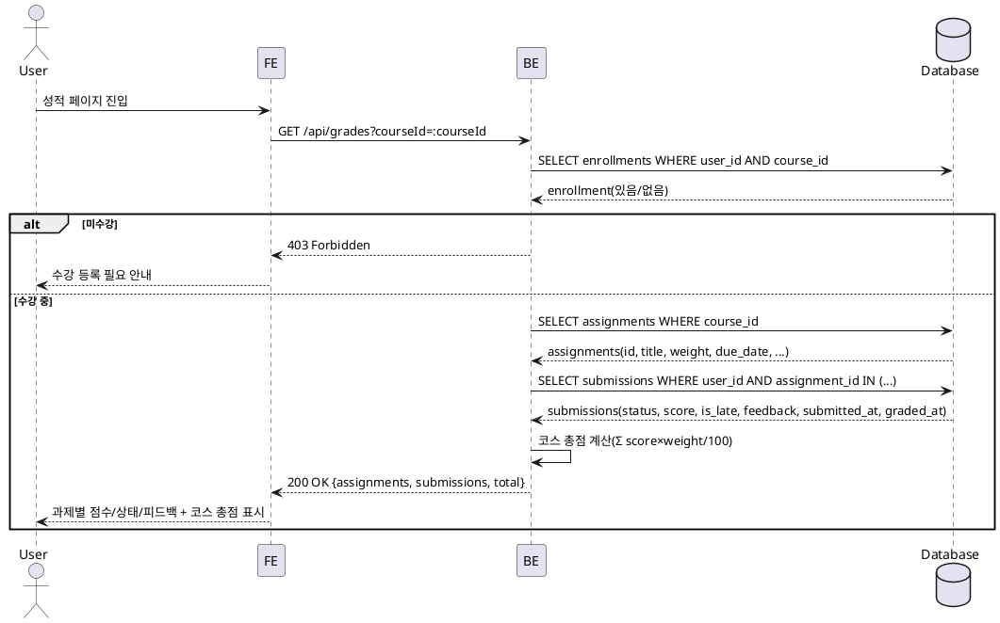

# Use Case: 성적 & 피드백 열람 (Learner)

## Primary Actor
- 학습자(Learner)

## Precondition (사용자 관점)
- 로그인 상태이며 역할이 Learner이다.
- 최소 1개 코스에 수강 등록되어 있다.

## Trigger
- 성적 페이지(코스별 성적 요약/상세)로 이동한다.

## Main Scenario
1. 사용자는 성적 페이지에 진입한다(코스 선택 가능).
2. 시스템은 수강 등록 여부를 확인한다.
3. 시스템은 선택한 코스의 과제 목록과 사용자의 제출물(점수/피드백/상태/지각)을 조회한다.
4. 시스템은 과제별 성적 정보를 표시한다(점수, 상태, 지각, 피드백 요약).
5. 시스템은 과제 비중(Weight)을 반영해 코스 총점을 계산하여 표시한다.
6. 시스템은 최근 피드백(채점 완료 기준)을 요약해 표시한다.

## Edge Cases (간략 처리)
- 미수강 코스 접근: 403 안내 및 접근 차단.
- 제출물 없음: "아직 제출한 과제가 없습니다" 안내.
- 채점 대기: 상태를 Submitted로 표시하고 점수 미표시.
- 네트워크/서버 오류: "성적 불러오기 실패" 재시도 안내.
- 과제 정보 불일치/누락: 조회 불가 과제는 제외하고 나머지로 총점 계산.

## Business Rules
- BR-001 접근 제어: 본인 제출물만 조회 가능하며 타 사용자 데이터는 노출 금지.
- BR-002 수강 검증: 수강 등록된 코스의 성적만 열람 가능.
- BR-003 점수 집계: 코스 총점 = Σ(assignment.score × assignment.weight/100). 점수가 없는 과제는 집계에서 0으로 간주.
- BR-004 상태 표시: 제출 상태(submitted/graded/resubmission_required), 지각 여부(is_late), 피드백(graded 시)을 함께 표시.
- BR-005 일관 포맷: 날짜/시간은 사용자 타임존으로 표시, 점수는 백분율(%) 표기.
- BR-006 성능/페이지네이션: 코스별 조회 시 필요한 범위만 조회(과제/제출물 조인 기준).

## Sequence Diagram

