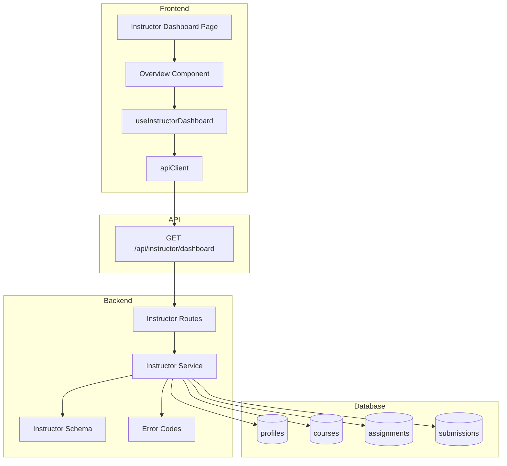

# Implementation Plan: Instructor 대시보드

## 개요

- Instructor Dashboard Error Codes — `src/features/instructor-dashboard/backend/error.ts`
  - 대시보드 조회 도메인 에러 코드 정의(UNAUTHORIZED, VALIDATION_ERROR, DATABASE_ERROR)
- Instructor Dashboard Schema — `src/features/instructor-dashboard/backend/schema.ts`
  - 응답 스키마: 소유 코스 목록, 코스별 채점 대기 수, 최근 제출물 리스트
- Instructor Dashboard Service — `src/features/instructor-dashboard/backend/service.ts`
  - 소유 코스 조회 → 코스의 과제 → 제출물 집계(status='submitted') → 최근 제출물(limit)
- Instructor Dashboard Routes — `src/features/instructor-dashboard/backend/route.ts`
  - `GET /api/instructor/dashboard` (Authorization: Bearer)
- DTO 재노출 — `src/features/instructor-dashboard/lib/dto.ts`
  - 프런트에서 재사용할 타입/스키마 재노출
- Hook — `src/features/instructor-dashboard/hooks/useInstructorDashboard.ts`
  - `useInstructorDashboard({ limit? })` with `@tanstack/react-query` + `api-client`
- Components — `src/features/instructor-dashboard/components/overview.tsx`
  - 코스 목록(상태 그룹), 채점 대기 카운트, 최근 제출물 카드 표시(“use client”)
- Page — `src/app/instructor/dashboard/page.tsx`
  - params: Promise<Record<string, never>>; 훅 연결 및 UI 렌더

## Diagram



## Implementation Plan

### Conformance Notes (AGENTS.md)
- 모든 컴포넌트/페이지는 `"use client"` 적용, `page.tsx`의 `params`는 `Promise` 타입 사용.
- 모든 HTTP 요청은 `@/lib/remote/api-client` 경유, 인증은 Authorization Bearer 헤더 처리.
- 서버 상태는 `@tanstack/react-query`로만 관리, 스키마 검증은 `zod`.
- 날짜/시간 포맷은 `date-fns` 유틸 재사용.

### Backend

1) Error Codes — `src/features/instructor-dashboard/backend/error.ts`
```ts
export const instructorDashboardErrorCodes = {
  unauthorized: 'UNAUTHORIZED',
  validationError: 'VALIDATION_ERROR',
  databaseError: 'DATABASE_ERROR',
} as const;
export type InstructorDashboardError = (typeof instructorDashboardErrorCodes)[keyof typeof instructorDashboardErrorCodes];
```

2) Schema — `src/features/instructor-dashboard/backend/schema.ts`
```ts
import { z } from 'zod';
export const InstructorDashboardQuerySchema = z.object({ limit: z.coerce.number().min(1).max(50).default(10) });
export const InstructorCourseSchema = z.object({ id: z.number(), title: z.string(), status: z.enum(['draft','published','archived']) });
export const PendingCountSchema = z.object({ courseId: z.number(), pending: z.number() });
export const RecentSubmissionSchema = z.object({
  assignmentId: z.number(),
  courseId: z.number(),
  title: z.string(),
  status: z.enum(['submitted','graded','resubmission_required']),
  submittedAt: z.string(),
  gradedAt: z.string().nullable(),
});
export const InstructorDashboardResponseSchema = z.object({
  courses: z.array(InstructorCourseSchema),
  pendingCounts: z.array(PendingCountSchema),
  recent: z.array(RecentSubmissionSchema),
});
export type InstructorDashboardResponse = z.infer<typeof InstructorDashboardResponseSchema>;
```

3) Service — `src/features/instructor-dashboard/backend/service.ts`
```ts
import type { SupabaseClient } from '@supabase/supabase-js';
import { success, failure, type HandlerResult } from '@/backend/http/response';
import { instructorDashboardErrorCodes, type InstructorDashboardError } from './error';
import type { InstructorDashboardResponse } from './schema';

export const getInstructorDashboard = async (
  client: SupabaseClient,
  userId: string,
  limit: number,
): Promise<HandlerResult<InstructorDashboardResponse, InstructorDashboardError, unknown>> => {
  // 1) 강사 소유 코스 조회
  // 2) 해당 코스의 과제 id 수집
  // 3) 제출물 중 status='submitted' 집계 → pendingCounts
  // 4) 최근 제출물: graded_at 또는 submitted_at 내림차순 LIMIT :limit
  // 5) 결과 매핑/정렬 후 success 반환
};
```

Unit Tests (Service)
- ✅ 코스가 없을 때 빈 데이터 반환
- ✅ submitted 상태만 채점 대기 집계됨
- ✅ 최근 제출물 정렬/개수 제한
- ✅ DB 오류 시 databaseError 매핑

4) Routes — `src/features/instructor-dashboard/backend/route.ts`
```ts
import type { Hono } from 'hono';
import { failure, respond } from '@/backend/http/response';
import { getSupabase, getLogger, type AppEnv } from '@/backend/hono/context';
import { InstructorDashboardQuerySchema } from './schema';
import { instructorDashboardErrorCodes } from './error';
import { getInstructorDashboard } from './service';

export const registerInstructorDashboardRoutes = (app: Hono<AppEnv>) => {
  app.get('/api/instructor/dashboard', async (c) => {
    const supabase = getSupabase(c);
    const logger = getLogger(c);

    const authHeader = c.req.header('Authorization');
    if (!authHeader?.startsWith('Bearer ')) {
      return respond(c, failure(401, instructorDashboardErrorCodes.unauthorized, 'Unauthorized'));
    }
    const token = authHeader.substring(7);
    const auth = await supabase.auth.getUser(token);
    if (auth.error || !auth.data.user) {
      return respond(c, failure(401, instructorDashboardErrorCodes.unauthorized, 'Unauthorized'));
    }

    const parsed = InstructorDashboardQuerySchema.safeParse(c.req.query());
    if (!parsed.success) {
      return respond(c, failure(400, instructorDashboardErrorCodes.validationError, 'Invalid query', parsed.error.format()));
    }

    const result = await getInstructorDashboard(supabase, auth.data.user.id, parsed.data.limit);
    if (!result.ok) logger.error('Failed to fetch instructor dashboard', JSON.stringify(result));
    return respond(c, result);
  });
};
```

5) Hono 등록 — `src/backend/hono/app.ts`
- `registerInstructorDashboardRoutes(app)` 호출 추가

### Frontend

6) DTO 재노출 — `src/features/instructor-dashboard/lib/dto.ts`
```ts
export {
  InstructorDashboardQuerySchema,
  InstructorDashboardResponseSchema,
  type InstructorDashboardResponse,
} from '@/features/instructor-dashboard/backend/schema';
```

7) Hook — `src/features/instructor-dashboard/hooks/useInstructorDashboard.ts`
```ts
'use client';
import { useQuery } from '@tanstack/react-query';
import { apiClient, extractApiErrorMessage } from '@/lib/remote/api-client';
import { InstructorDashboardResponseSchema, type InstructorDashboardResponse } from '@/features/instructor-dashboard/lib/dto';

export const useInstructorDashboard = (options?: { limit?: number }) => {
  const limit = options?.limit ?? 10;
  return useQuery<InstructorDashboardResponse>({
    queryKey: ['instructor','dashboard', limit],
    queryFn: async () => {
      let headers: Record<string, string> | undefined;
      if (typeof window !== 'undefined') {
        const token = localStorage.getItem('auth_token');
        if (token) headers = { Authorization: `Bearer ${token}` };
      }
      try {
        const { data } = await apiClient.get('/api/instructor/dashboard', { params: { limit }, headers });
        return InstructorDashboardResponseSchema.parse(data);
      } catch (error) {
        throw new Error(extractApiErrorMessage(error, '대시보드 데이터를 불러오지 못했습니다.'));
      }
    },
  });
};
```

8) Component — `src/features/instructor-dashboard/components/overview.tsx`
- “use client”
- 코스 상태 그룹(draft/published/archived) 섹션
- 코스별 채점 대기 배지
- 최근 제출물 리스트(제출/채점시각 포맷)
- 오류/로딩/빈 상태 처리(shadcn-ui Alert/Skeleton)

QA Sheet (Presentation)
- [ ] Instructor가 아닐 때 접근 차단 안내
- [ ] 코스가 없을 때 빈 상태 안내(코스 생성 CTA)
- [ ] 코스 상태 그룹화 및 개수 표기
- [ ] 코스별 채점 대기 수 정확 표시
- [ ] 최근 제출물 정렬/개수 제한 반영
- [ ] 날짜 포맷 일관성 및 접근성(aria-labels) 점검

9) Page — `src/app/instructor/dashboard/page.tsx`
- “use client”; `params: Promise<Record<string, never>>`
- Overview 컴포넌트 렌더 및 브레드크럼

### Integration
- `src/backend/hono/app.ts`에 `registerInstructorDashboardRoutes(app)` 등록
- 타입/린트/빌드 무오류 검증(tsc, next lint, build)

## Testing Strategy

- Backend Unit Tests
  - 코스/과제/제출물 조인 및 집계 로직 검증
  - 빈 데이터/DB 오류/인증 실패 케이스
- Frontend QA
  - 로딩/빈/에러/정상 시나리오 확인
  - 상태 그룹/집계/최근 제출물 UI 정확성
