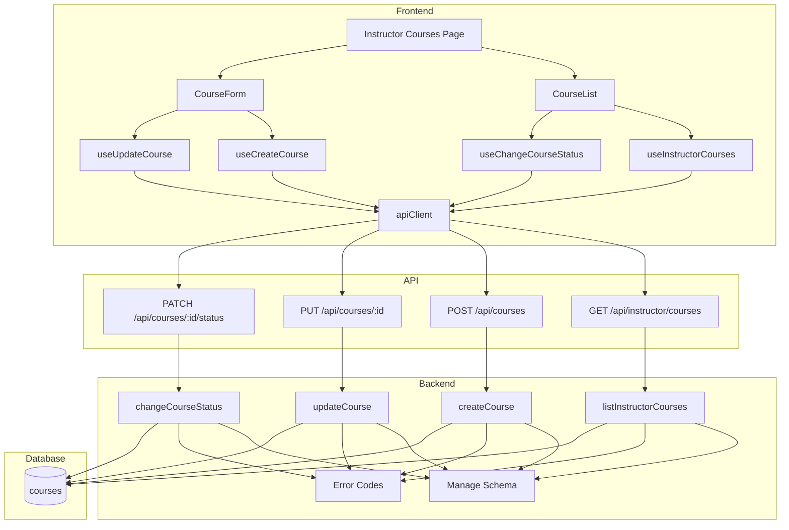

# Implementation Plan: 코스 관리 (Instructor)

## 개요

- Course Error Codes (관리 확장) — `src/features/courses/backend/error.ts`
  - 관리 전용 오류 추가: `UNAUTHORIZED`, `FORBIDDEN`, `VALIDATION_ERROR`, `DATABASE_ERROR`, `NOT_FOUND`, `INVALID_STATUS_TRANSITION`
- Course Manage Schema — `src/features/courses/backend/manage.schema.ts`
  - `CreateCourseRequestSchema`, `UpdateCourseRequestSchema`, `ChangeCourseStatusSchema`
  - `InstructorCourseSchema`(관리 화면용), `InstructorCoursesResponseSchema`
- Course Manage Service — `src/features/courses/backend/manage.service.ts`
  - `listInstructorCourses(client, instructorId)`
  - `createCourse(client, instructorId, payload)`
  - `updateCourse(client, instructorId, courseId, payload)`
  - `changeCourseStatus(client, instructorId, courseId, to)`
  - 소유자 검증, 상태 전환 규칙, 필드 유효성 처리
- Course Manage Routes — `src/features/courses/backend/manage.route.ts`
  - `GET /api/instructor/courses`
  - `POST /api/courses`
  - `PUT /api/courses/:id`
  - `PATCH /api/courses/:id/status`
  - Authorization Bearer, 역할 가드(Instructor), `respond()` 사용
- DTO 재노출 — `src/features/courses/lib/manage.dto.ts`
  - 프런트 훅/컴포넌트에서 사용할 스키마/타입 재노출
- Hooks — `src/features/courses/hooks/instructor/*`
  - `useInstructorCourses()` — 본인 소유 코스 목록
  - `useCreateCourse()` — 생성
  - `useUpdateCourse(courseId)` — 수정
  - `useChangeCourseStatus(courseId)` — 상태 전환
  - 모두 `@/lib/remote/api-client` 경유, `@tanstack/react-query` mutation/query
- Components — `src/features/courses/components/instructor/*`
  - `CourseForm`(react-hook-form + zodResolver), `CourseList`, `StatusBadge`
- Page — `src/app/instructor/courses/page.tsx`
  - params: `Promise<Record<string, never>>`; 목록/생성/수정 UI 구성

## Diagram



## Implementation Plan

### Conformance Notes (AGENTS.md)
- 모든 페이지/컴포넌트는 `"use client"` 유지, `page.tsx`의 `params`는 `Promise` 타입 사용.
- 모든 HTTP는 `@/lib/remote/api-client` 경유하고, 인증은 Authorization Bearer 헤더로 처리.
- 서버 상태는 `@tanstack/react-query`로만 관리. 스키마 검증은 `zod`.
- UI는 `shadcn-ui`(Button/Input/Card/Alert/Skeleton 등) 사용, 날짜는 `date-fns`.

### Backend

1) Error Codes — `src/features/courses/backend/error.ts`
- 이미 존재하는 에러코드에 관리 전용 코드를 확장 또는 보완
```ts
export const courseErrorCodes = {
  // ...기존
  unauthorized: 'UNAUTHORIZED',
  forbidden: 'FORBIDDEN',
  validationError: 'VALIDATION_ERROR',
  databaseError: 'DATABASE_ERROR',
  notFound: 'COURSE_NOT_FOUND',
  invalidStatusTransition: 'INVALID_STATUS_TRANSITION',
} as const;
```

2) Manage Schema — `src/features/courses/backend/manage.schema.ts`
```ts
import { z } from 'zod';
export const CreateCourseRequestSchema = z.object({
  title: z.string().min(1),
  description: z.string().nullable().optional(),
  categoryId: z.number().nullable().optional(),
  difficultyId: z.number().nullable().optional(),
  curriculum: z.string().nullable().optional(),
});
export const UpdateCourseRequestSchema = CreateCourseRequestSchema;
export const ChangeCourseStatusSchema = z.object({ to: z.enum(['draft','published','archived']) });
export const InstructorCourseSchema = z.object({
  id: z.number(),
  title: z.string(),
  status: z.enum(['draft','published','archived']),
  updatedAt: z.string(),
});
export const InstructorCoursesResponseSchema = z.object({ courses: z.array(InstructorCourseSchema) });
export type CreateCourseRequest = z.infer<typeof CreateCourseRequestSchema>;
export type UpdateCourseRequest = z.infer<typeof UpdateCourseRequestSchema>;
export type ChangeCourseStatusRequest = z.infer<typeof ChangeCourseStatusSchema>;
export type InstructorCourse = z.infer<typeof InstructorCourseSchema>;
```

3) Manage Service — `src/features/courses/backend/manage.service.ts`
- `listInstructorCourses`: instructor_id로 코스 전부 조회(draft/published/archived), 최신 업데이트 순
- `createCourse`: 필수값 검증 → INSERT(draft) → 생성 레코드 반환
- `updateCourse`: instructor_id/코스 소유 검증 → UPDATE → 레코드 반환
- `changeCourseStatus`: 유효한 상태 전환만 허용(draft→published, published→archived)
- 공통: 오류시 `failure(…, courseErrorCodes.databaseError|notFound|invalidStatusTransition)`

Unit Tests (Service)
- ✅ 소유 검증 실패 시 forbidden
- ✅ 생성 시 title 누락→validationError
- ✅ 상태 전환 규칙(draft→published, published→archived 허용 / 그 외 차단)
- ✅ 리스트 최신 업데이트 순 정렬
- ✅ DB 오류 전파(databaseError)

4) Manage Routes — `src/features/courses/backend/manage.route.ts`
- GET /api/instructor/courses — Bearer + profiles.role='instructor' 가드
- POST /api/courses — Bearer + role 가드 + body zod → createCourse
- PUT /api/courses/:id — Bearer + role 가드 + body zod → updateCourse
- PATCH /api/courses/:id/status — Bearer + role 가드 + zod → changeCourseStatus
- 응답은 `respond()` 사용, 성공 시 스키마로 파싱/검증(optional)

5) Hono 등록 — `src/backend/hono/app.ts`
- `registerCourseManageRoutes(app)` 호출 추가(파일명에 맞춤)

### Frontend

6) DTO 재노출 — `src/features/courses/lib/manage.dto.ts`
```ts
export {
  CreateCourseRequestSchema,
  UpdateCourseRequestSchema,
  ChangeCourseStatusSchema,
  InstructorCourseSchema,
  InstructorCoursesResponseSchema,
  type CreateCourseRequest,
  type UpdateCourseRequest,
  type ChangeCourseStatusRequest,
  type InstructorCourse,
} from '@/features/courses/backend/manage.schema';
```

7) Hooks — `src/features/courses/hooks/instructor/*`
```ts
// useInstructorCourses.ts
return useQuery({ queryKey: ['instructor','courses'], queryFn: () => api.get('/api/instructor/courses') })

// useCreateCourse.ts
return useMutation({ mutationFn: (body) => api.post('/api/courses', body), onSuccess: invalidate(['instructor','courses']) })

// useUpdateCourse.ts
return useMutation({ mutationFn: (body) => api.put(`/api/courses/${id}`, body), onSuccess: invalidate([...]) })

// useChangeCourseStatus.ts
return useMutation({ mutationFn: (body) => api.patch(`/api/courses/${id}/status`, body), onSuccess: invalidate([...]) })
```
- 모든 훅은 `@/lib/remote/api-client` 경유, Authorization 헤더 첨부
- 성공 시 관련 쿼리 무효화(목록/상세)

8) Components — `src/features/courses/components/instructor/*`
- `CourseForm`: react-hook-form + zodResolver로 유효성 검증, 생성/수정 모드 지원
- `CourseList`: 상태별 그룹핑, 상태 배지, 전환 버튼, 수정 CTA
- `StatusBadge`: draft/published/archived 시각 구분

QA Sheet (Presentation)
- [ ] 제목 미입력 시 폼 에러 표시 및 제출 불가
- [ ] 생성 후 목록 갱신 및 성공 피드백
- [ ] 수정 후 변경사항 반영 및 성공 피드백
- [ ] draft→published / published→archived 전환 동작 및 UI 반영
- [ ] Instructor가 아닐 때 접근 차단 안내
- [ ] 네트워크 오류 메시지와 재시도 제공

9) Page — `src/app/instructor/courses/page.tsx`
- “use client”; `params: Promise<Record<string, never>>`
- CourseList + CourseForm 배치, 반응형 레이아웃

### Integration
- Hono 앱에 관리 라우트 등록
- 타입/린트/빌드 무오류 검증(tsc, next lint, build)

## Testing Strategy

- Backend Unit Tests
  - 상태 전환 규칙/소유 검증/유효성/DB 오류 사례 검증
- Frontend QA
  - 폼 검증/상태 전환 UI/목록 갱신/오류 처리/권한 가드 시나리오 점검
