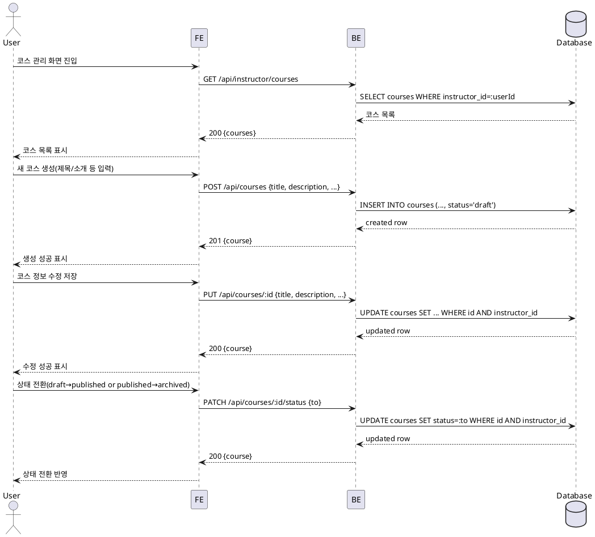

# Use Case: 코스 관리 (Instructor)

## Primary Actor
- 강사(Instructor)

## Precondition (사용자 관점)
- 로그인 상태이며 역할이 Instructor이다.

## Trigger
- 코스 관리 화면으로 이동해 코스를 생성/수정하거나 상태를 전환한다.

## Main Scenario
1. 사용자는 코스 관리 화면에 진입한다.
2. 시스템은 사용자 역할이 Instructor임을 확인하고, 사용자가 소유한 코스 목록을 표시한다.
3. 사용자는 새 코스 생성 버튼을 눌러 제목/소개/카테고리/난이도/커리큘럼을 입력한다.
4. 시스템은 필수 필드 유효성을 검사하고 코스를 `draft` 상태로 생성한다.
5. 사용자는 기존 코스를 선택해 정보(제목/소개/커리큘럼 등)를 수정하고 저장한다.
6. 사용자는 상태 전환을 수행한다:
   - `draft → published`: 공개되어 학습자에게 노출됨.
   - `published → archived`: 신규 수강신청 차단.
7. 시스템은 상태 전환 규칙을 검증하고 DB에 반영한다.
8. 성공 시 목록/상세에 변경사항이 반영된다.

## Edge Cases (간략 처리)
- 권한 오류: Instructor가 아니면 403 및 접근 차단 안내.
- 유효성 오류: 필수 필드 누락/형식 오류 시 저장 차단 및 필드 오류 표시.
- 상태 전환 제한: 이미 `archived`인 코스는 재공개 불가(정책에 따라 제한).
- 참조 무결성: 존재하지 않는 코스 수정/전환 시 404 안내.
- 네트워크/서버 오류: "저장/전환 실패" 재시도 안내.

## Business Rules
- BR-001 소유자 권한: 코스 생성/수정/전환은 소유 Instructor만 가능.
- BR-002 상태 정의: 코스 상태는 `draft | published | archived` 중 하나.
- BR-003 공개 규칙: `draft → published` 시 학습자 카탈로그에 노출.
- BR-004 보관 규칙: `published → archived` 시 신규 수강신청 차단(기존 수강에는 영향 없음).
- BR-005 유효성: 제목은 필수, 길이/입력 형식은 서버에서 검증.
- BR-006 감사성: 업데이트는 `updated_at`를 갱신(트리거로 관리).

## Sequence Diagram

