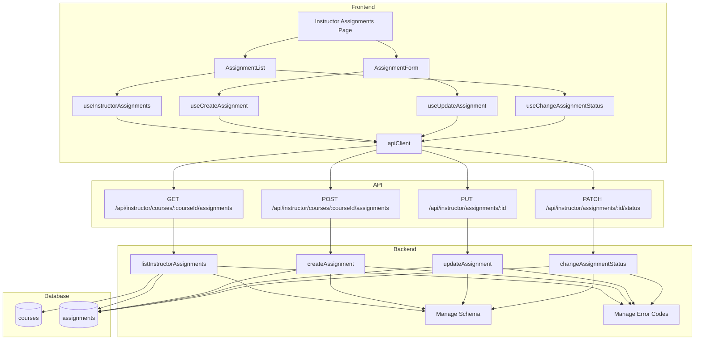

# Implementation Plan: 과제 관리 (Instructor)

## 개요

- Assignment Manage Error Codes — `src/features/assignments/backend/manage.error.ts`
  - 관리 전용 오류 정의: `UNAUTHORIZED`, `FORBIDDEN`, `VALIDATION_ERROR`, `DATABASE_ERROR`, `ASSIGNMENT_NOT_FOUND`, `INVALID_STATUS_TRANSITION`
- Assignment Manage Schema — `src/features/assignments/backend/manage.schema.ts`
  - `CreateAssignmentRequestSchema`(title, description?, dueDate, weight, allowLate, allowResubmission)
  - `UpdateAssignmentRequestSchema`(description?, dueDate, weight, policies)
  - `ChangeAssignmentStatusSchema`(to: `draft|published|closed`)
  - `InstructorAssignmentSchema`(id, title, status, dueDate, weight, updatedAt)
  - `InstructorAssignmentsResponseSchema`({ assignments })
- Assignment Manage Service — `src/features/assignments/backend/manage.service.ts`
  - `listInstructorAssignments(client, instructorId, courseId)`
  - `createAssignment(client, instructorId, courseId, payload)`
  - `updateAssignment(client, instructorId, assignmentId, payload)`
  - `changeAssignmentStatus(client, instructorId, assignmentId, to)`
  - 코스 소유자 검증 → 유효성/상태 전환 규칙 → DB 반영
- Assignment Manage Routes — `src/features/assignments/backend/manage.route.ts`
  - `GET /api/instructor/courses/:courseId/assignments`
  - `POST /api/instructor/courses/:courseId/assignments`
  - `PUT /api/instructor/assignments/:id`
  - `PATCH /api/instructor/assignments/:id/status`
  - Authorization Bearer + profiles.role='instructor' + 코스 소유 검증, `respond()` 사용
- DTO 재노출 — `src/features/assignments/lib/manage.dto.ts`
  - 프런트에서 사용할 타입/스키마 재노출
- Hooks — `src/features/assignments/hooks/instructor/*`
  - `useInstructorAssignments(courseId)` — 목록 조회
  - `useCreateAssignment(courseId)` — 생성
  - `useUpdateAssignment(assignmentId)` — 수정
  - `useChangeAssignmentStatus(assignmentId)` — 상태 전환
  - 모두 `@/lib/remote/api-client` 경유, `@tanstack/react-query` 사용
- Components — `src/features/assignments/components/instructor/*`
  - `AssignmentForm`(react-hook-form + zodResolver): 생성/수정
  - `AssignmentList`(상태/비중/마감일/정책 표시 + 전환 버튼)
  - `AssignmentStatusBadge`
- Page — `src/app/instructor/courses/[courseId]/assignments/page.tsx`
  - params: `Promise<{ courseId: string }>`; 목록/폼 UI 구성(“use client”)

## Diagram



## Implementation Plan

### Conformance Notes (AGENTS.md)
- 모든 페이지/컴포넌트는 `"use client"` 유지, `page.tsx`는 `params: Promise<...>` 사용.
- 모든 HTTP는 `@/lib/remote/api-client` 경유, Authorization Bearer 헤더 필수.
- 서버 상태는 `@tanstack/react-query`, 스키마는 `zod`로 검증/공유.
- 날짜/시간 처리 `date-fns`, UI는 `shadcn-ui` 컴포넌트 사용.

### Backend

1) Error Codes — `src/features/assignments/backend/manage.error.ts`
```ts
export const assignmentManageErrorCodes = {
  unauthorized: 'UNAUTHORIZED',
  forbidden: 'FORBIDDEN',
  validationError: 'VALIDATION_ERROR',
  databaseError: 'DATABASE_ERROR',
  notFound: 'ASSIGNMENT_NOT_FOUND',
  invalidStatusTransition: 'INVALID_STATUS_TRANSITION',
} as const;
export type AssignmentManageError = (typeof assignmentManageErrorCodes)[keyof typeof assignmentManageErrorCodes];
```

2) Schema — `src/features/assignments/backend/manage.schema.ts`
```ts
import { z } from 'zod';
export const CreateAssignmentRequestSchema = z.object({
  title: z.string().min(1),
  description: z.string().nullable().optional(),
  dueDate: z.string(), // ISO
  weight: z.number().min(0).max(100),
  allowLate: z.boolean(),
  allowResubmission: z.boolean(),
});
export const UpdateAssignmentRequestSchema = z.object({
  description: z.string().nullable().optional(),
  dueDate: z.string(),
  weight: z.number().min(0).max(100),
  allowLate: z.boolean(),
  allowResubmission: z.boolean(),
});
export const ChangeAssignmentStatusSchema = z.object({ to: z.enum(['draft','published','closed']) });
export const InstructorAssignmentSchema = z.object({
  id: z.number(),
  title: z.string(),
  status: z.enum(['draft','published','closed']),
  dueDate: z.string(),
  weight: z.number(),
  updatedAt: z.string(),
});
export const InstructorAssignmentsResponseSchema = z.object({ assignments: z.array(InstructorAssignmentSchema) });
```

3) Service — `src/features/assignments/backend/manage.service.ts`
- 소유자 검증: `courses.instructor_id = userId` 여부 확인
- `listInstructorAssignments`: 코스의 모든 assignments 조회(상태 무관), 최신 업데이트 순
- `createAssignment`: 필수값/범위 검증 후 INSERT(status='draft')
- `updateAssignment`: 소유자/대상 존재 검증 → UPDATE(description/due_date/weight/policies)
- `changeAssignmentStatus`: 유효 전환만 허용(`draft→published`, `published→closed`)
- 실패 시 `failure(…, assignmentManageErrorCodes.*)`로 대응

Unit Tests (Service)
- ✅ 소유 검증 실패 → forbidden
- ✅ 생성 시 필수값/범위 위반 → validationError
- ✅ 상태 전환 규칙 위반 → invalidStatusTransition
- ✅ 목록 최신 업데이트 순/정확한 필드 매핑
- ✅ DB 오류 전파(databaseError)

4) Routes — `src/features/assignments/backend/manage.route.ts`
```ts
// GET /api/instructor/courses/:courseId/assignments
// POST /api/instructor/courses/:courseId/assignments
// PUT /api/instructor/assignments/:id
// PATCH /api/instructor/assignments/:id/status
// - Bearer + role=instructor 가드
// - 코스 소유자 검증(courses.instructor_id=userId)
// - zod body/param 검증, respond() 사용
```

5) Hono 등록 — `src/backend/hono/app.ts`
- `registerAssignmentManageRoutes(app)` 호출 추가

### Frontend

6) DTO 재노출 — `src/features/assignments/lib/manage.dto.ts`
```ts
export {
  CreateAssignmentRequestSchema,
  UpdateAssignmentRequestSchema,
  ChangeAssignmentStatusSchema,
  InstructorAssignmentSchema,
  InstructorAssignmentsResponseSchema,
} from '@/features/assignments/backend/manage.schema';
```

7) Hooks — `src/features/assignments/hooks/instructor/*`
```ts
// useInstructorAssignments.ts
useQuery({ queryKey: ['instructor','assignments', courseId], queryFn: () => api.get(`/api/instructor/courses/${courseId}/assignments`) })

// useCreateAssignment.ts
useMutation({ mutationFn: (body) => api.post(`/api/instructor/courses/${courseId}/assignments`, body), onSuccess: invalidate(['instructor','assignments', courseId]) })

// useUpdateAssignment.ts
useMutation({ mutationFn: (body) => api.put(`/api/instructor/assignments/${id}`, body), onSuccess: invalidate([...]) })

// useChangeAssignmentStatus.ts
useMutation({ mutationFn: (body) => api.patch(`/api/instructor/assignments/${id}/status`, body), onSuccess: invalidate([...]) })
```
- 모든 훅은 Authorization 헤더 첨부, 오류 메시지는 `extractApiErrorMessage` 사용

8) Components — `src/features/assignments/components/instructor/*`
- `AssignmentForm`:
  - “use client”; react-hook-form + zodResolver
  - 필드: 제목, 설명, 마감일(ISO), 비중(0~100), allowLate, allowResubmission
  - 생성/수정 모드 지원, 성공/오류 Alert
- `AssignmentList`:
  - 상태/비중/마감일/정책 일부 표시
  - 상태 전환 버튼(공개/마감), 성공 시 목록 무효화
- `AssignmentStatusBadge`:
  - draft/published/closed 시각 구분

QA Sheet (Presentation)
- [ ] 제목/마감일/비중 유효성 위반 시 폼 에러 표시 및 제출 차단
- [ ] 생성/수정 성공 후 목록 갱신 및 성공 피드백
- [ ] draft→published / published→closed 전환 동작 및 UI 반영
- [ ] Instructor/소유자 가드 실패 시 안내
- [ ] 네트워크 오류 메시지 및 재시도 제공

9) Page — `src/app/instructor/courses/[courseId]/assignments/page.tsx`
- “use client”; `params: Promise<{ courseId: string }>`
- AssignmentList + AssignmentForm 배치, 반응형 레이아웃

### Integration
- Hono 앱에 `registerAssignmentManageRoutes(app)` 등록
- 타입/린트/빌드 무오류 검증(tsc, next lint, build)

## Testing Strategy

- Backend Unit Tests
  - 소유자 검증/상태 전환 규칙/유효성/DB 오류 사례 검증
- Frontend QA
  - 폼 검증/전환 UI/목록 갱신/오류 처리/가드 시나리오 점검
