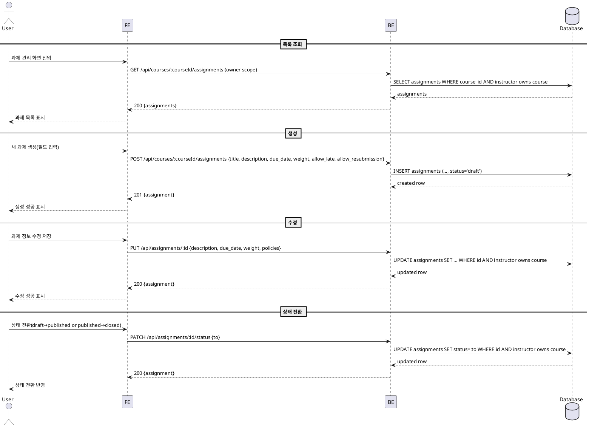

# Use Case: 과제 관리 (Instructor)

## Primary Actor
- 강사(Instructor)

## Precondition (사용자 관점)
- 로그인 상태이며 역할이 Instructor이다.
- 본인이 소유한 코스를 선택했다.

## Trigger
- 과제 관리 화면에서 과제를 생성/수정하거나 상태를 전환한다.

## Main Scenario
1. 사용자는 코스의 과제 관리 화면에 진입한다.
2. 시스템은 소유자 권한을 확인하고 해당 코스의 과제 목록을 표시한다.
3. 사용자는 새 과제 생성 버튼을 눌러 제목/설명/마감일/점수 비중/지각·재제출 정책을 입력한다.
4. 시스템은 필수값과 범위를 검증하고 `draft` 상태로 과제를 생성한다.
5. 사용자는 목록에서 과제를 선택해 정보(설명/마감일/비중/정책)를 수정하고 저장한다.
6. 사용자는 상태 전환을 수행한다:
   - `draft → published`: 학습자에게 노출됨.
   - `published → closed`: 제출 마감(수동 마감).
7. 시스템은 상태 전환 규칙을 검증하고 DB에 반영한다.
8. 성공 시 목록/상세가 갱신된다.

## Edge Cases (간략 처리)
- 권한 오류: 소유자가 아니거나 Instructor가 아니면 403 및 안내.
- 유효성 오류: 제목 누락/마감일 형식/비중 범위(0~100) 위반 시 저장 차단 및 필드 오류 표시.
- 상태 전환 제한: `closed`는 재개 불가(정책), 잘못된 전환은 400.
- 참조 무결성: 존재하지 않는 코스/과제는 404.
- 네트워크/서버 오류: "저장/전환 실패" 재시도 안내.

## Business Rules
- BR-001 소유자 검증: 과제 관리(생성/수정/전환)는 코스 소유 Instructor만 가능.
- BR-002 상태 정의: `draft | published | closed`.
- BR-003 게시 규칙: `draft → published` 시 Learner에게 노출(열람/제출 정책은 별도 규칙 따름).
- BR-004 마감 규칙: `published → closed` 전환 시 제출 차단(수동 마감). 마감일 경과 시 자동 마감은 운영 정책에 따라 서버에서 반영.
- BR-005 정책 필드: `allow_late`, `allow_resubmission`을 명시 저장.
- BR-006 비중 규칙: `weight`는 0~100, 숫자.
- BR-007 시간/표기: 날짜/시간은 ISO 문자열 저장, 표시 시 사용자 타임존으로 포맷.
- BR-008 감사성: `updated_at` 갱신(트리거 사용).

## Sequence Diagram

